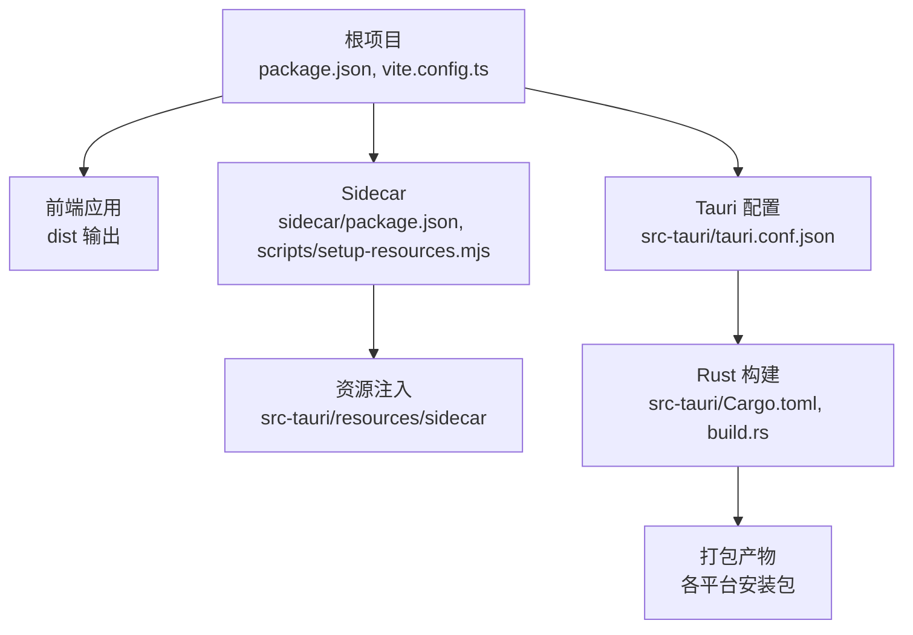
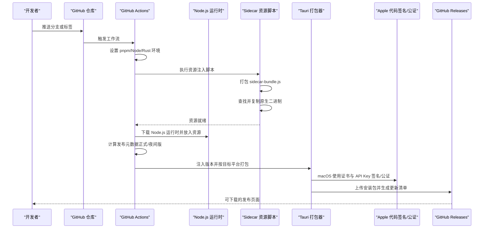
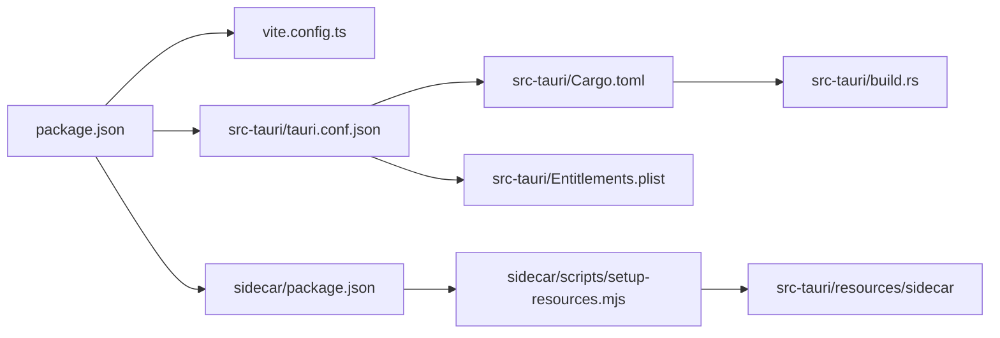

# 部署和发布

<cite>
**本文引用的文件**
- [.github/workflows/build.yml](file://.github/workflows/build.yml)
- [package.json](file://package.json)
- [vite.config.ts](file://vite.config.ts)
- [src-tauri/tauri.conf.json](file://src-tauri/tauri.conf.json)
- [src-tauri/Cargo.toml](file://src-tauri/Cargo.toml)
- [src-tauri/build.rs](file://src-tauri/build.rs)
- [src-tauri/Entitlements.plist](file://src-tauri/Entitlements.plist)
- [src-tauri/capabilities/default.json](file://src-tauri/capabilities/default.json)
- [sidecar/package.json](file://sidecar/package.json)
- [sidecar/scripts/setup-resources.mjs](file://sidecar/scripts/setup-resources.mjs)
</cite>

## 目录
1. [简介](#简介)
2. [项目结构](#项目结构)
3. [核心组件](#核心组件)
4. [架构总览](#架构总览)
5. [详细组件分析](#详细组件分析)
6. [依赖关系分析](#依赖关系分析)
7. [性能与可靠性考量](#性能与可靠性考量)
8. [故障排查指南](#故障排查指南)
9. [结论](#结论)
10. [附录](#附录)

## 简介
本文件面向 RabbitCoding 的运维与发布团队，系统化梳理从开发到发布的完整流程，覆盖以下主题：
- 构建流程与跨平台打包策略
- Tauri 应用的打包配置、签名与公证机制
- 分发渠道与版本管理策略
- 持续集成与自动化发布
- 部署环境准备、配置管理与回滚机制
- 不同平台的特殊要求与注意事项
- 具体部署示例与发布指导

## 项目结构
RabbitCoding 采用前端（React + Vite）+ 后端（Rust + Tauri）+ Sidecar（原生二进制与打包脚本）的多模块组织方式。关键目录与职责如下：
- 前端与构建：根目录下的 package.json、vite.config.ts、src 等，负责应用界面与开发服务器。
- Tauri 应用：src-tauri 下的 tauri.conf.json、Cargo.toml、build.rs、Entitlements.plist、capabilities 等，负责桌面端打包、资源注入与权限控制。
- Sidecar：sidecar 目录包含原生二进制与打包脚本，用于在构建期将侧车资源复制到 Tauri 资源目录。

图表来源
- [package.json:1-46](file://package.json#L1-L46)
- [vite.config.ts:1-37](file://vite.config.ts#L1-L37)
- [sidecar/package.json:1-25](file://sidecar/package.json#L1-L25)
- [sidecar/scripts/setup-resources.mjs:1-153](file://sidecar/scripts/setup-resources.mjs#L1-L153)
- [src-tauri/tauri.conf.json:1-52](file://src-tauri/tauri.conf.json#L1-L52)
- [src-tauri/Cargo.toml:1-40](file://src-tauri/Cargo.toml#L1-L40)
- [src-tauri/build.rs:1-45](file://src-tauri/build.rs#L1-L45)

章节来源
- [package.json:1-46](file://package.json#L1-L46)
- [vite.config.ts:1-37](file://vite.config.ts#L1-L37)
- [sidecar/package.json:1-25](file://sidecar/package.json#L1-L25)
- [sidecar/scripts/setup-resources.mjs:1-153](file://sidecar/scripts/setup-resources.mjs#L1-L153)
- [src-tauri/tauri.conf.json:1-52](file://src-tauri/tauri.conf.json#L1-L52)
- [src-tauri/Cargo.toml:1-40](file://src-tauri/Cargo.toml#L1-L40)
- [src-tauri/build.rs:1-45](file://src-tauri/build.rs#L1-L45)

## 核心组件
- 持续集成与发布流水线：基于 GitHub Actions 的多平台矩阵构建，自动注入版本信息、生成更新清单并签名与公证。
- 前端构建与开发服务器：Vite 配置固定端口与 HMR，配合 Tauri 开发模式。
- Tauri 应用配置：产品名称、版本、打包目标、资源列表、图标、能力集与深链协议等。
- Rust 依赖与构建：Cargo.toml 声明插件与系统库，build.rs 确保资源占位以满足 Tauri glob 规则。
- Sidecar 资源注入：脚本自动定位平台原生二进制与打包后的 sidecar-bundle.js，并写入资源目录。
- macOS 权限与签名：Entitlements.plist 放宽 JIT/动态库加载限制，配合 Apple 证书与 API Key 实现签名与公证。

章节来源
- [.github/workflows/build.yml:1-196](file://.github/workflows/build.yml#L1-L196)
- [vite.config.ts:1-37](file://vite.config.ts#L1-L37)
- [src-tauri/tauri.conf.json:1-52](file://src-tauri/tauri.conf.json#L1-L52)
- [src-tauri/Cargo.toml:1-40](file://src-tauri/Cargo.toml#L1-L40)
- [src-tauri/build.rs:1-45](file://src-tauri/build.rs#L1-L45)
- [sidecar/scripts/setup-resources.mjs:1-153](file://sidecar/scripts/setup-resources.mjs#L1-L153)
- [src-tauri/Entitlements.plist:1-19](file://src-tauri/Entitlements.plist#L1-L19)

## 架构总览
下图展示从代码提交到发布产物的关键路径，包括版本推断、资源注入、打包与签名、以及更新通道配置。

图表来源
- [.github/workflows/build.yml:174-196](file://.github/workflows/build.yml#L174-L196)
- [sidecar/scripts/setup-resources.mjs:105-133](file://sidecar/scripts/setup-resources.mjs#L105-L133)
- [src-tauri/tauri.conf.json:26-43](file://src-tauri/tauri.conf.json#L26-L43)

章节来源
- [.github/workflows/build.yml:1-196](file://.github/workflows/build.yml#L1-L196)
- [sidecar/scripts/setup-resources.mjs:1-153](file://sidecar/scripts/setup-resources.mjs#L1-L153)
- [src-tauri/tauri.conf.json:1-52](file://src-tauri/tauri.conf.json#L1-L52)

## 详细组件分析

### 持续集成与发布流水线（GitHub Actions）
- 触发条件：主分支推送、标签推送（以 v 开头）、手动触发。
- 并发控制：同一分支/引用的多次推送会取消前序构建，避免堆积。
- 矩阵构建：同时在 macOS（Intel/ARM）、Windows（x64/ARM64）上构建。
- 关键步骤：
  - 安装 pnpm、Node.js、Rust（按目标架构）。
  - 安装根依赖与 sidecar 依赖并打包 sidecar。
  - 执行资源注入脚本，复制 sidecar-bundle.js 与原生二进制至 src-tauri/resources。
  - 下载 Node.js 运行时并放入资源目录（Unix 与 Windows 分别处理）。
  - 验证 sidecar 二进制存在性。
  - macOS 写入 Apple API Key 私钥文件。
  - 计算发布元数据：正式版取标签版本，夜间版基于自 2024-01-01 的天数作为预发布段。
  - 注入版本号与更新通道（夜间版指向 nightly 更新清单）。
  - 使用 tauri-action 执行打包、签名与发布，生成最新清单并上传到 GitHub Releases。

章节来源
- [.github/workflows/build.yml:1-196](file://.github/workflows/build.yml#L1-L196)

### 前端构建与开发服务器（Vite）
- 固定开发端口与严格端口策略，确保 Tauri dev 模式稳定。
- HMR 配置支持远程主机热更新。
- 忽略对 src-tauri 的监听，避免不必要的重编译。

章节来源
- [vite.config.ts:1-37](file://vite.config.ts#L1-L37)

### Tauri 应用配置（tauri.conf.json）
- 产品与版本：productName、version、identifier。
- 构建入口：devUrl、beforeDevCommand、beforeBuildCommand、frontendDist。
- 应用窗口与安全：窗口尺寸、标题栏样式、CSP 策略。
- 打包配置：targets 为 all，资源包含 sidecar 与 node-runtime，图标清单，macOS Entitlements。
- 插件：深链协议 rabbitcoding。
- 能力集：default.json 定义窗口拖拽、通知、文件系统读写范围、PTY、窗口状态等权限。

章节来源
- [src-tauri/tauri.conf.json:1-52](file://src-tauri/tauri.conf.json#L1-L52)
- [src-tauri/capabilities/default.json:1-41](file://src-tauri/capabilities/default.json#L1-L41)

### Rust 依赖与构建（Cargo.toml 与 build.rs）
- 依赖：Tauri 核心、Shell/Fs/Dialog/Notification/PTY、SQLite、reqwest、图像处理、深链等。
- 构建：启用 unstable/devtools 功能，lib crate 类型包含 staticlib、cdylib、rlib。
- build.rs：在本地开发时为 sidecar 与 node-runtime 创建占位文件，确保 Tauri glob 能匹配资源目录。

章节来源
- [src-tauri/Cargo.toml:1-40](file://src-tauri/Cargo.toml#L1-L40)
- [src-tauri/build.rs:1-45](file://src-tauri/build.rs#L1-L45)

### Sidecar 资源注入脚本（setup-resources.mjs）
- 自动化逻辑：
  - 可选先执行 esbuild 打包 sidecar-bundle.js。
  - 复制 sidecar-bundle.js 到 src-tauri/resources/sidecar。
  - 查找并复制平台原生二进制（优先从 SDK optionalDependencies，再从 pnpm store，最后从 sidecar node_modules）。
  - Unix 平台设置可执行权限。
  - 确保 resources/sidecar/package.json 存在（ESM 环境）。
  - 最终验证 sidecar-bundle.js 与原生二进制均存在。

章节来源
- [sidecar/scripts/setup-resources.mjs:1-153](file://sidecar/scripts/setup-resources.mjs#L1-L153)

### macOS 权限与签名（Entitlements.plist）
- 允许 JIT 与可执行内存分配，允许加载未签名动态库，允许设置 DYLD 环境变量。
- 与 Apple 证书及 API Key 配合，在 CI 中完成签名与公证。

章节来源
- [src-tauri/Entitlements.plist:1-19](file://src-tauri/Entitlements.plist#L1-L19)

### 版本管理与更新通道
- 正式版：当 ref 为 tags 且以 v 开头时，使用标签版本作为应用版本，发布为正式版。
- 夜间版：当 ref 为 main 或手动触发时，应用版本为 baseVersion 加上自 2024-01-01 的天数（纯数字，≤65535），发布为预发布；同时更新更新通道指向 nightly 清单。
- 更新清单：tauri-action 自动生成 latest.json（供 upgrader 使用），nightly 模式下指向 nightly 更新端点。

章节来源
- [.github/workflows/build.yml:128-171](file://.github/workflows/build.yml#L128-L171)
- [src-tauri/tauri.conf.json:44-50](file://src-tauri/tauri.conf.json#L44-L50)

## 依赖关系分析
- 语言与工具链：Node.js（pnpm）、Rust（stable）、esbuild（sidecar 打包）。
- 第三方 SDK：@anthropic-ai/claude-agent-sdk（原生二进制随平台分发）。
- Tauri 插件：Shell、Fs、Dialog、Notification、PTY、Window-State、Deep-Link 等。
- 资源依赖：前端 dist、sidecar-bundle.js、原生二进制、Node.js 运行时。

图表来源
- [package.json:1-46](file://package.json#L1-L46)
- [vite.config.ts:1-37](file://vite.config.ts#L1-L37)
- [sidecar/package.json:1-25](file://sidecar/package.json#L1-L25)
- [sidecar/scripts/setup-resources.mjs:1-153](file://sidecar/scripts/setup-resources.mjs#L1-L153)
- [src-tauri/tauri.conf.json:1-52](file://src-tauri/tauri.conf.json#L1-L52)
- [src-tauri/Cargo.toml:1-40](file://src-tauri/Cargo.toml#L1-L40)
- [src-tauri/build.rs:1-45](file://src-tauri/build.rs#L1-L45)
- [src-tauri/Entitlements.plist:1-19](file://src-tauri/Entitlements.plist#L1-L19)

章节来源
- [package.json:1-46](file://package.json#L1-L46)
- [sidecar/package.json:1-25](file://sidecar/package.json#L1-L25)
- [src-tauri/tauri.conf.json:1-52](file://src-tauri/tauri.conf.json#L1-L52)
- [src-tauri/Cargo.toml:1-40](file://src-tauri/Cargo.toml#L1-L40)
- [src-tauri/build.rs:1-45](file://src-tauri/build.rs#L1-L45)
- [src-tauri/Entitlements.plist:1-19](file://src-tauri/Entitlements.plist#L1-L19)

## 性能与可靠性考量
- 并发与缓存：GitHub Actions 对 Rust 与 Node 依赖分别启用缓存，减少重复安装时间。
- 资源注入幂等：build.rs 在本地为 sidecar 与 node-runtime 创建占位文件，避免 Tauri glob 匹配失败。
- 平台差异：Windows 与 Unix 在 Node.js 运行时下载与解压方式不同，需确保网络与磁盘空间充足。
- 夜间版预发布段限制：MSI/WiX 要求预发布段为纯数字且不超过 65535，采用“距 2024-01-01 的天数”规避溢出风险。

章节来源
- [.github/workflows/build.yml:60-64](file://.github/workflows/build.yml#L60-L64)
- [src-tauri/build.rs:6-44](file://src-tauri/build.rs#L6-L44)
- [.github/workflows/build.yml:142-146](file://.github/workflows/build.yml#L142-L146)

## 故障排查指南
- 资源缺失
  - 症状：构建时报错找不到 sidecar-bundle.js 或原生二进制。
  - 排查：确认 sidecar 打包成功、setup-resources.mjs 是否执行、资源目录是否存在。
  - 参考：资源注入脚本的验证输出与错误提示。
- Node.js 运行时未就绪
  - 症状：打包阶段无法找到 src-tauri/resources/node-runtime。
  - 排查：检查下载步骤是否成功、目录结构是否正确。
- macOS 签名/公证失败
  - 症状：应用启动崩溃或沙盒问题。
  - 排查：确认 Apple 证书、密码、API Issuer、API Key 与私钥文件路径正确。
- 夜间版更新异常
  - 症状：客户端无法获取更新或更新通道错误。
  - 排查：确认 tauri.conf.json 中更新端点已注入 nightly 清单地址。

章节来源
- [sidecar/scripts/setup-resources.mjs:120-133](file://sidecar/scripts/setup-resources.mjs#L120-L133)
- [.github/workflows/build.yml:93-104](file://.github/workflows/build.yml#L93-L104)
- [src-tauri/Entitlements.plist:1-19](file://src-tauri/Entitlements.plist#L1-L19)
- [.github/workflows/build.yml:164-171](file://.github/workflows/build.yml#L164-L171)

## 结论
本项目通过 GitHub Actions 实现了跨平台的自动化打包与发布，结合 Sidecar 资源注入与 Tauri 的能力集与权限模型，提供了稳定的桌面端体验。版本管理策略清晰区分正式版与夜间版，更新通道与签名机制完善，适合在多平台上进行持续交付与快速迭代。

## 附录

### 部署与发布步骤（操作指引）
- 准备环境
  - 安装 pnpm、Node.js 与 Rust 工具链。
  - 准备 Apple 代码签名证书、证书密码、Apple API Issuer 与 API Key（macOS 打包）。
  - 准备 Tauri 签名私钥与密码（用于更新清单签名）。
- 本地构建与验证
  - 安装根依赖与 sidecar 依赖。
  - 执行 sidecar 打包与资源注入脚本。
  - 运行 Tauri 开发或构建命令，验证功能正常。
- 自动化发布
  - 推送标签（如 v0.x.y）触发正式版发布。
  - 推送主分支或手动触发触发夜间版发布。
  - 在 GitHub Releases 查看产物与更新清单。

章节来源
- [.github/workflows/build.yml:1-196](file://.github/workflows/build.yml#L1-L196)
- [sidecar/scripts/setup-resources.mjs:105-133](file://sidecar/scripts/setup-resources.mjs#L105-L133)
- [src-tauri/tauri.conf.json:1-52](file://src-tauri/tauri.conf.json#L1-L52)

### 平台特殊要求与注意事项
- macOS
  - 需要 Apple 证书与 API Key 完成签名与公证。
  - Entitlements.plist 放宽 JIT/动态库加载限制，确保 Node 子进程正常运行。
- Windows
  - MSI/WiX 要求预发布段为纯数字且不超过 65535，夜间版采用“距 2024-01-01 的天数”规避溢出。
  - Node.js 运行时下载与解压采用 PowerShell 脚本。
- Linux
  - 当前工作流未包含 Linux 目标；如需支持，可在矩阵中添加相应平台并提供对应原生二进制与打包配置。

章节来源
- [src-tauri/Entitlements.plist:1-19](file://src-tauri/Entitlements.plist#L1-L19)
- [.github/workflows/build.yml:142-146](file://.github/workflows/build.yml#L142-L146)
- [.github/workflows/build.yml:93-104](file://.github/workflows/build.yml#L93-L104)