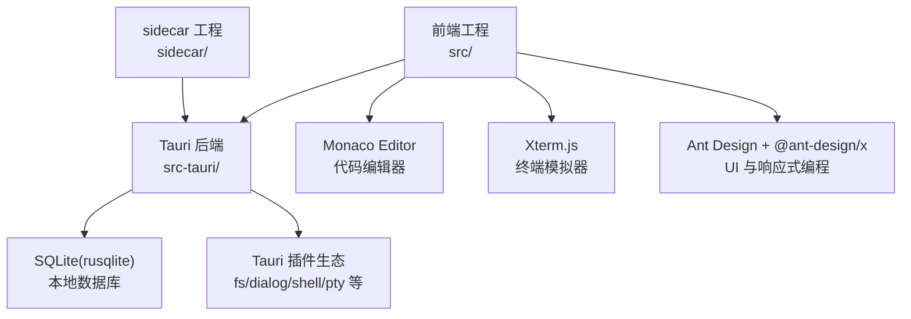
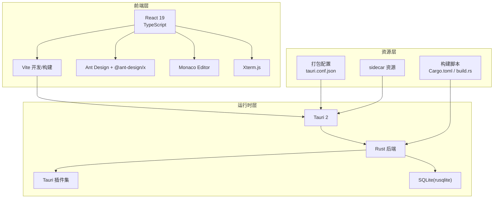
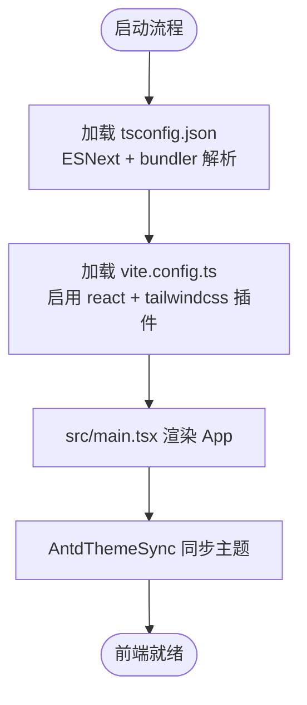
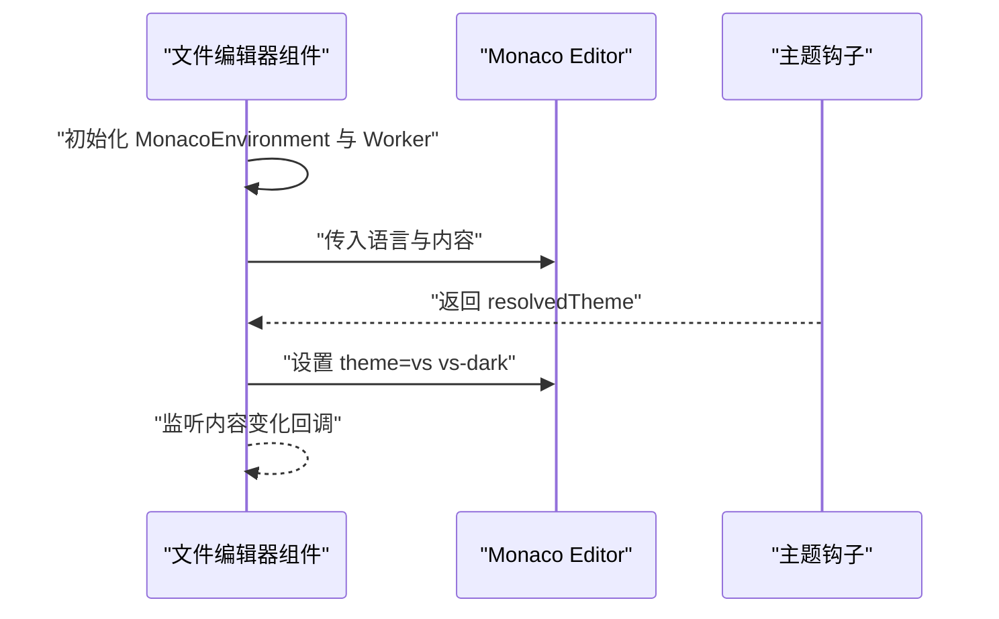
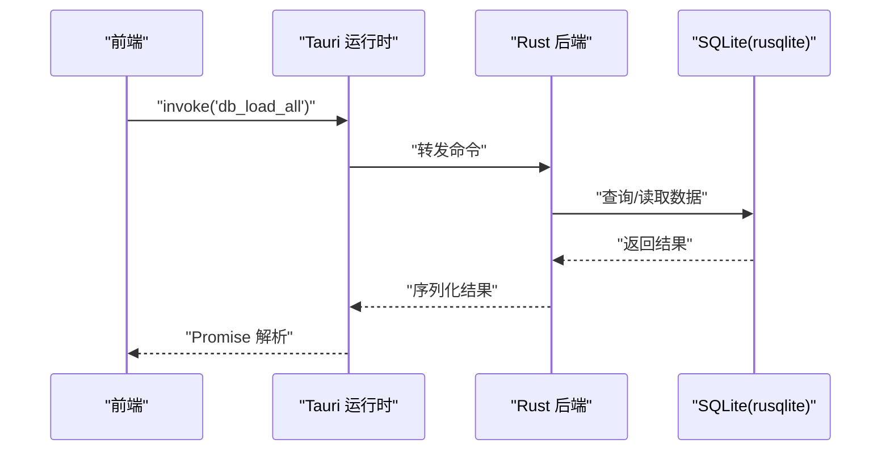
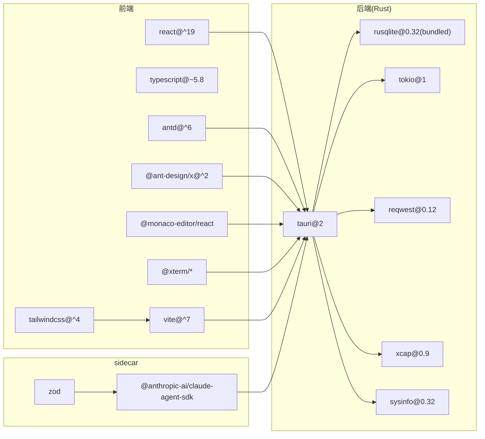

# 技术栈概览

<cite>
**本文引用的文件**
- [package.json](file://package.json)
- [vite.config.ts](file://vite.config.ts)
- [tsconfig.json](file://tsconfig.json)
- [tsconfig.node.json](file://tsconfig.node.json)
- [src/main.tsx](file://src/main.tsx)
- [src/App.tsx](file://src/App.tsx)
- [src-tauri/Cargo.toml](file://src-tauri/Cargo.toml)
- [src-tauri/tauri.conf.json](file://src-tauri/tauri.conf.json)
- [src-tauri/src/lib.rs](file://src-tauri/src/lib.rs)
- [src-tauri/src/main.rs](file://src-tauri/src/main.rs)
- [src-tauri/build.rs](file://src-tauri/build.rs)
- [src/components/files/FileEditor.tsx](file://src/components/files/FileEditor.tsx)
- [sidecar/package.json](file://sidecar/package.json)
- [README.md](file://README.md)
</cite>

## 目录
1. [简介](#简介)
2. [项目结构](#项目结构)
3. [核心组件](#核心组件)
4. [架构总览](#架构总览)
5. [详细组件分析](#详细组件分析)
6. [依赖关系分析](#依赖关系分析)
7. [性能考量](#性能考量)
8. [故障排查指南](#故障排查指南)
9. [结论](#结论)
10. [附录](#附录)

## 简介
本文件为 RabbitCoding 项目提供全面的技术栈概览，重点覆盖前端与后端技术选型、关键依赖库的作用与优势、跨平台桌面应用的架构设计、以及版本兼容性与依赖关系说明。项目采用 React 19 + TypeScript + Vite 作为前端框架，使用 Tauri 2 作为桌面应用运行时，后端逻辑由 Rust 编写并通过 Tauri 插件与 SQLite（rusqlite）交互，同时集成 Monaco Editor 与 Xterm.js 提供代码编辑与终端能力。

## 项目结构
项目采用“前端 + Tauri 后端 + sidecar 子工程”的多工程组织方式：
- 前端工程位于 src/，使用 Vite + React 19 + TypeScript 构建，通过 Ant Design 及其响应式编程扩展 @ant-design/x 提供 UI 与状态管理能力。
- Tauri 后端位于 src-tauri/，使用 Rust 编写，Cargo.toml 定义了 Tauri 2 与 rusqlite 等依赖，构建产物通过 tauri.conf.json 配置打包与资源分发。
- sidecar 工程位于 sidecar/，提供与外部服务（如 Claude Agent SDK）通信的侧车进程，负责资源准备与打包。

图表来源
- [src-tauri/Cargo.toml:20-39](file://src-tauri/Cargo.toml#L20-L39)
- [package.json:14-44](file://package.json#L14-L44)
- [src-tauri/tauri.conf.json:6-11](file://src-tauri/tauri.conf.json#L6-L11)

章节来源
- [package.json:1-46](file://package.json#L1-L46)
- [vite.config.ts:1-37](file://vite.config.ts#L1-L37)
- [tsconfig.json:1-26](file://tsconfig.json#L1-L26)
- [tsconfig.node.json:1-11](file://tsconfig.node.json#L1-L11)
- [src/main.tsx:1-11](file://src/main.tsx#L1-L11)
- [src/App.tsx:1-107](file://src/App.tsx#L1-L107)
- [src-tauri/Cargo.toml:1-40](file://src-tauri/Cargo.toml#L1-L40)
- [src-tauri/tauri.conf.json:1-52](file://src-tauri/tauri.conf.json#L1-L52)
- [src-tauri/src/lib.rs:197-390](file://src-tauri/src/lib.rs#L197-L390)
- [src-tauri/src/main.rs:1-7](file://src-tauri/src/main.rs#L1-L7)
- [src-tauri/build.rs:1-45](file://src-tauri/build.rs#L1-L45)
- [sidecar/package.json:1-25](file://sidecar/package.json#L1-L25)
- [README.md:1-8](file://README.md#L1-L8)

## 核心组件
- 前端框架与工具链
  - React 19：用于构建用户界面，配合 TypeScript 提供类型安全。
  - Vite：开发服务器与构建工具，支持热更新与快速打包。
  - Tailwind CSS：实用优先的样式框架，结合 @tailwindcss/vite 插件在构建时处理。
  - Ant Design + @ant-design/x：提供企业级 UI 组件与响应式编程能力，增强状态管理与数据流。
  - 国际化与主题：I18nProvider 与 ThemeProvider 协同实现多语言与深色/浅色主题切换。
- 代码编辑与终端
  - Monaco Editor：本地化部署的代码编辑器，支持多语言语法高亮与智能提示。
  - Xterm.js：终端模拟器，结合 tauri-pty 插件实现伪终端交互。
- 桌面应用运行时
  - Tauri 2：轻量级桌面应用框架，Rust 后端 + Web 前端，提供原生系统能力访问。
  - SQLite（rusqlite）：嵌入式数据库，用于本地数据持久化。
  - Tauri 插件：dialog、fs、shell、notification、opener、pty、window-state、deep-link 等。
- sidecar 子工程
  - 用于与外部 AI 服务（Claude Agent SDK）通信，提供资源准备与打包脚本。

章节来源
- [package.json:14-44](file://package.json#L14-L44)
- [vite.config.ts:1-37](file://vite.config.ts#L1-L37)
- [src/App.tsx:16-28](file://src/App.tsx#L16-L28)
- [src/components/files/FileEditor.tsx:1-182](file://src/components/files/FileEditor.tsx#L1-L182)
- [src-tauri/Cargo.toml:20-39](file://src-tauri/Cargo.toml#L20-L39)
- [src-tauri/tauri.conf.json:44-50](file://src-tauri/tauri.conf.json#L44-L50)
- [sidecar/package.json:1-25](file://sidecar/package.json#L1-L25)

## 架构总览
RabbitCoding 的整体架构围绕“前端 Web + Tauri 后端 + Rust 插件 + 本地数据库”展开。前端通过 Vite 开发服务器运行，Tauri 在 dev/build 时桥接前端与 Rust 后端，Rust 侧通过插件访问系统能力与本地资源，SQLite 存储应用数据，Monaco Editor 与 Xterm.js 提供编辑与终端体验。

图表来源
- [src-tauri/tauri.conf.json:6-11](file://src-tauri/tauri.conf.json#L6-L11)
- [src-tauri/Cargo.toml:20-39](file://src-tauri/Cargo.toml#L20-L39)
- [src-tauri/build.rs:1-45](file://src-tauri/build.rs#L1-45)
- [package.json:8-12](file://package.json#L8-L12)

## 详细组件分析

### 前端技术栈与配置
- React 19 + TypeScript
  - tsconfig.json 采用 ESNext 模块解析与 bundler 模式，启用严格模式与 JSX React 19 渲染器。
  - src/main.tsx 作为入口，渲染 App 组件。
- Vite 配置
  - vite.config.ts 启用 react 与 tailwindcss 插件，固定开发端口 1420，禁用清屏以避免 Rust 错误被隐藏。
  - 忽略对 src-tauri 的监听，减少不必要的文件变更扫描。
- Ant Design 与主题同步
  - App.tsx 中通过 AntdThemeSync 将 useTheme 的主题状态同步至 Ant Design ConfigProvider，实现深色/浅色主题一致切换。

图表来源
- [tsconfig.json:2-22](file://tsconfig.json#L2-L22)
- [vite.config.ts:9-36](file://vite.config.ts#L9-L36)
- [src/main.tsx:1-11](file://src/main.tsx#L1-L11)
- [src/App.tsx:16-28](file://src/App.tsx#L16-L28)

章节来源
- [tsconfig.json:1-26](file://tsconfig.json#L1-L26)
- [tsconfig.node.json:1-11](file://tsconfig.node.json#L1-L11)
- [vite.config.ts:1-37](file://vite.config.ts#L1-L37)
- [src/main.tsx:1-11](file://src/main.tsx#L1-L11)
- [src/App.tsx:16-28](file://src/App.tsx#L16-L28)

### 代码编辑器（Monaco Editor）
- 本地化部署：通过自定义 MonacoEnvironment 与 worker 资源，确保不依赖 CDN，提升离线可用性与语言支持完整性。
- 语言识别：根据文件扩展名映射到对应语言，覆盖主流编程语言与标记语言。
- 主题适配：依据 useTheme 返回的主题状态动态选择 vs 或 vs-dark。

图表来源
- [src/components/files/FileEditor.tsx:121-182](file://src/components/files/FileEditor.tsx#L121-L182)

章节来源
- [src/components/files/FileEditor.tsx:1-182](file://src/components/files/FileEditor.tsx#L1-L182)

### 终端模拟器（Xterm.js + tauri-pty）
- 终端视图：TerminalView 与 useTerminal 钩子组合，提供终端实例与交互能力。
- 伪终端：通过 tauri-pty 插件与后端命令通道协作，实现跨平台终端功能。
- 插件集成：Xterm.js 的 addon-canvas 与 addon-fit 提升渲染性能与自适应布局。

章节来源
- [package.json:26-28](file://package.json#L26-L28)
- [src-tauri/Cargo.toml:26](file://src-tauri/Cargo.toml#L26](file://src-tauri/Cargo.toml#L26)

### Tauri 2 桌面应用运行时
- 配置与打包
  - tauri.conf.json 指定前端构建产物位置、开发 URL、窗口属性与资源图标，开启 deep-link 方案。
  - build.rs 在本地编译时生成占位资源，CI 环境由流水线注入真实 sidecar 与 Node 运行时。
- Rust 后端
  - src/lib.rs 定义命令与插件注册，包括窗口状态管理、通知、文件系统、PTY、数据库初始化、认证回调服务等。
  - main.rs 设置 Windows 控制台行为并调用 run() 启动应用。
- 数据库与网络诊断
  - rusqlite 作为嵌入式数据库，提供数据持久化能力；db 命令集封装加载/保存/检查数据。
  - network 命令集提供 DNS/HTTP/Ping/市场连通性诊断。

图表来源
- [src-tauri/src/lib.rs:344-387](file://src-tauri/src/lib.rs#L344-L387)
- [src-tauri/Cargo.toml:30](file://src-tauri/Cargo.toml#L30)

章节来源
- [src-tauri/tauri.conf.json:1-52](file://src-tauri/tauri.conf.json#L1-L52)
- [src-tauri/src/lib.rs:197-390](file://src-tauri/src/lib.rs#L197-L390)
- [src-tauri/src/main.rs:1-7](file://src-tauri/src/main.rs#L1-L7)
- [src-tauri/build.rs:1-45](file://src-tauri/build.rs#L1-L45)
- [src-tauri/Cargo.toml:20-39](file://src-tauri/Cargo.toml#L20-L39)

### sidecar 子工程
- 作用：承载与外部服务（Claude Agent SDK）通信的侧车进程，提供资源准备与打包脚本。
- 关键脚本：setup-resources 用于准备 sidecar 资源；bundle 用于生成 sidecar-bundle.js。
- 依赖：@anthropic-ai/claude-agent-sdk 与 zod，开发期使用 esbuild 打包。

章节来源
- [sidecar/package.json:1-25](file://sidecar/package.json#L1-L25)

## 依赖关系分析
- 前端依赖
  - React 19 与 React DOM：UI 渲染基础。
  - Ant Design 与 @ant-design/x：UI 组件与响应式编程扩展。
  - Monaco Editor 与 @monaco-editor/react：本地化代码编辑器。
  - Xterm.js 与 @xterm/*：终端模拟器与适配插件。
  - Tailwind CSS 与 @tailwindcss/vite：样式框架与构建插件。
  - Tauri 前端 API 与插件：dialog、fs、shell、notification、opener、deep-link。
- 后端依赖（Rust）
  - Tauri 2：应用框架与插件生态。
  - rusqlite：SQLite 访问与打包特性。
  - tokio：异步运行时。
  - reqwest/base64/image：网络与图像处理。
  - xcap/sysinfo：屏幕捕获与系统信息。
- sidecar
  - @anthropic-ai/claude-agent-sdk：外部服务 SDK。
  - zod：参数校验。

图表来源
- [package.json:14-44](file://package.json#L14-L44)
- [src-tauri/Cargo.toml:20-39](file://src-tauri/Cargo.toml#L20-L39)
- [sidecar/package.json:12-20](file://sidecar/package.json#L12-L20)

章节来源
- [package.json:14-44](file://package.json#L14-L44)
- [src-tauri/Cargo.toml:20-39](file://src-tauri/Cargo.toml#L20-L39)
- [sidecar/package.json:12-20](file://sidecar/package.json#L12-L20)

## 性能考量
- Vite 开发体验
  - 固定端口与严格端口策略避免端口冲突；HMR 在指定主机上启用，提升远程开发体验。
  - 忽略 src-tauri 监听，降低文件系统压力。
- 前端渲染与主题
  - Ant Design 主题算法与 useTheme 协同，减少重复渲染与样式抖动。
- 终端与编辑器
  - Xterm.js 的 addon-fit 与 addon-canvas 提升渲染效率；Monaco Editor 本地 worker 避免 CDN 依赖带来的网络延迟。
- 后端与数据库
  - rusqlite 嵌入式数据库无需额外进程，降低启动与维护成本；窗口状态插件自动保存窗口尺寸与位置，减少重排开销。

章节来源
- [vite.config.ts:15-36](file://vite.config.ts#L15-L36)
- [src/App.tsx:16-28](file://src/App.tsx#L16-L28)
- [src/components/files/FileEditor.tsx:156-179](file://src/components/files/FileEditor.tsx#L156-L179)
- [src-tauri/src/lib.rs:203-204](file://src-tauri/src/lib.rs#L203-L204)

## 故障排查指南
- 开发端口占用
  - 现象：dev 启动失败或端口冲突。
  - 排查：确认 1420/1421 端口未被占用；若使用远程主机，检查 host 配置与 HMR 协议。
- Rust 错误被隐藏
  - 现象：控制台输出被 Vite 清屏导致看不到错误。
  - 排查：保持 clearScreen=false，查看完整日志。
- 资源缺失（本地编译）
  - 现象：sidecar 或 Node 运行时资源未找到。
  - 排查：执行 sidecar 的 setup-resources 脚本；确保 build.rs 生成的占位文件被替换为真实资源。
- 数据库初始化失败
  - 现象：db_* 命令报错或功能降级。
  - 排查：检查应用数据目录可写性；确认 sqlite 初始化流程与路径正确。
- 通知与深色模式
  - 现象：通知无法弹出或主题不同步。
  - 排查：确认 send_desktop_notification 与 open_notification_settings 命令可用；检查 AntdThemeSync 是否包裹根组件。

章节来源
- [vite.config.ts:18-20](file://vite.config.ts#L18-L20)
- [src-tauri/build.rs:8-42](file://src-tauri/build.rs#L8-L42)
- [src-tauri/src/lib.rs:213-222](file://src-tauri/src/lib.rs#L213-L222)
- [src-tauri/src/lib.rs:137-186](file://src-tauri/src/lib.rs#L137-L186)
- [src/App.tsx:16-28](file://src/App.tsx#L16-L28)

## 结论
RabbitCoding 采用“前端 Web + Tauri 2 + Rust 后端 + 本地数据库”的现代桌面应用架构，前端以 React 19 + TypeScript + Vite 为基础，结合 Ant Design 与 @ant-design/x 提供企业级 UI 与响应式编程能力；后端以 Tauri 2 为核心，rusqlite 提供轻量数据库，sidecar 工程支撑外部服务集成。Monaco Editor 与 Xterm.js 分别满足代码编辑与终端场景需求，整体方案兼顾开发效率、用户体验与跨平台一致性。

## 附录

### 版本兼容性与依赖关系说明
- 前端
  - React 19 与 TypeScript 5.8.x：严格类型与模块解析兼容。
  - Vite 7 与 @vitejs/plugin-react：热更新与 React 19 JSX 渲染。
  - Tailwind CSS 4 与 @tailwindcss/vite：构建期样式处理。
  - Ant Design 6 与 @ant-design/x：UI 组件与响应式编程。
  - Monaco Editor 与 @monaco-editor/react：本地化部署与多语言支持。
  - Xterm.js 与 @xterm/addon-*：终端渲染与自适应。
- 后端（Rust）
  - Tauri 2：应用框架与插件生态。
  - rusqlite 0.32（bundled）：SQLite 访问与打包特性。
  - tokio 1：异步运行时。
  - reqwest/base64/image：网络与图像处理。
- sidecar
  - @anthropic-ai/claude-agent-sdk：外部服务 SDK。
  - zod：参数校验。

章节来源
- [package.json:14-44](file://package.json#L14-L44)
- [src-tauri/Cargo.toml:20-39](file://src-tauri/Cargo.toml#L20-L39)
- [sidecar/package.json:12-20](file://sidecar/package.json#L12-L20)
- [README.md:1-8](file://README.md#L1-L8)