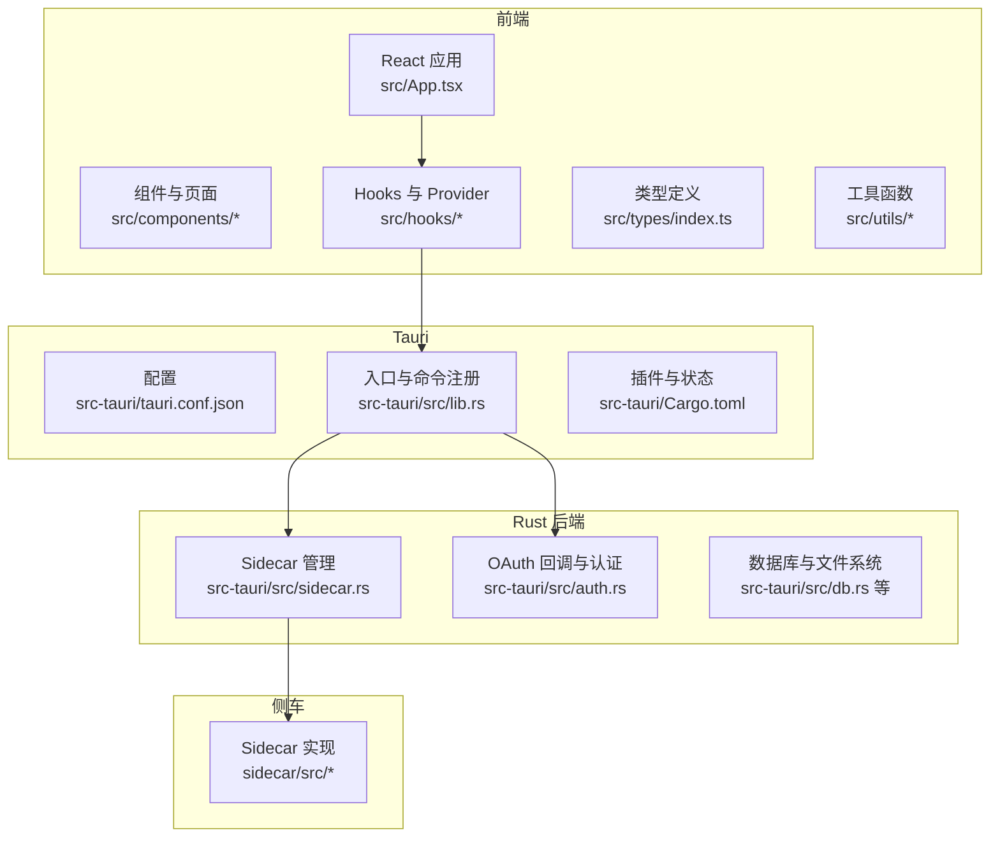
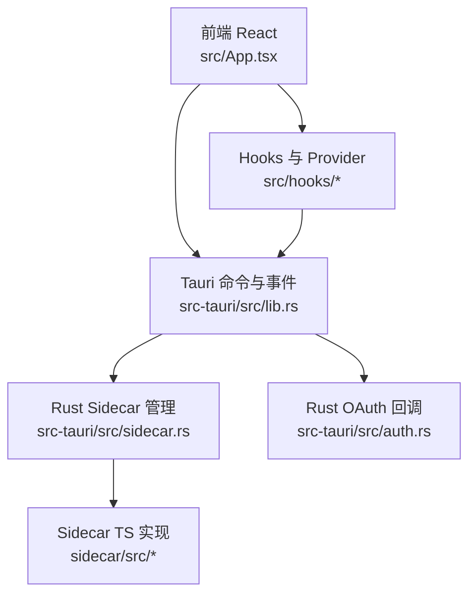
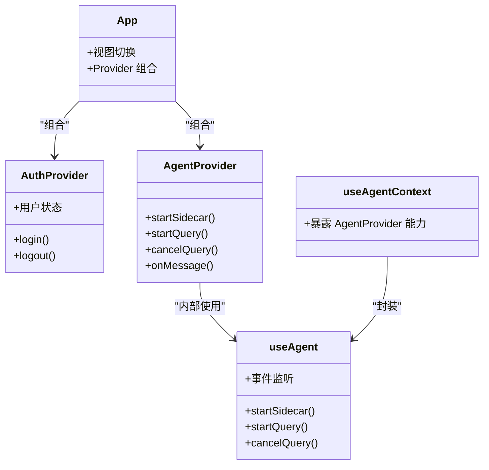
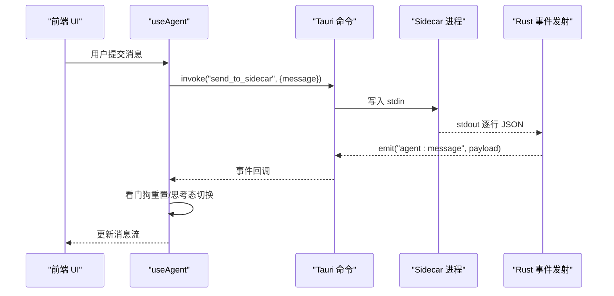
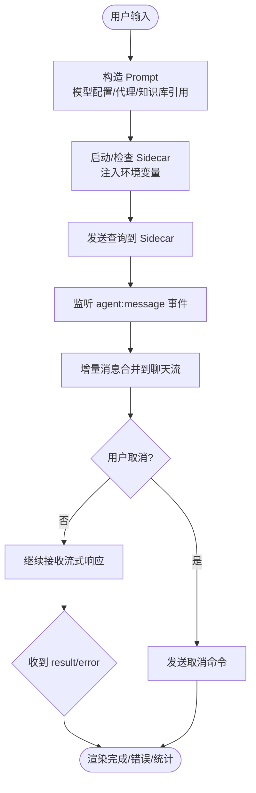
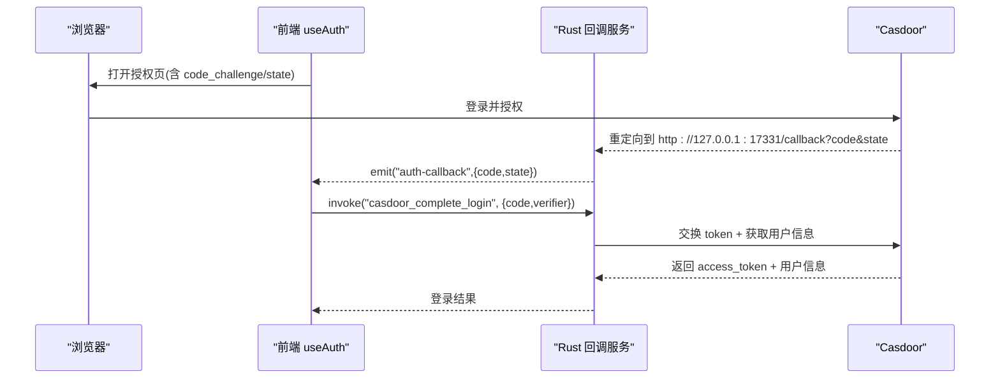
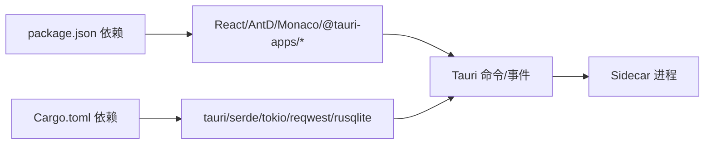

# 架构设计理念

<cite>
**本文档引用的文件**
- [README.md](file://README.md)
- [package.json](file://package.json)
- [src-tauri/Cargo.toml](file://src-tauri/Cargo.toml)
- [src-tauri/tauri.conf.json](file://src-tauri/tauri.conf.json)
- [src-tauri/src/lib.rs](file://src-tauri/src/lib.rs)
- [src-tauri/src/sidecar.rs](file://src-tauri/src/sidecar.rs)
- [src-tauri/src/auth.rs](file://src-tauri/src/auth.rs)
- [src/App.tsx](file://src/App.tsx)
- [src/constants/providers.ts](file://src/constants/providers.ts)
- [src/hooks/useAgent.ts](file://src/hooks/useAgent.ts)
- [src/hooks/useAgentContext.tsx](file://src/hooks/useAgentContext.tsx)
- [src/hooks/useAuth.tsx](file://src/hooks/useAuth.tsx)
- [src/components/ContentArea.tsx](file://src/components/ContentArea.tsx)
- [src/types/index.ts](file://src/types/index.ts)
- [src/utils/proxy.ts](file://src/utils/proxy.ts)
- [src/utils/specGenerator.ts](file://src/utils/specGenerator.ts)
</cite>

## 目录
1. [简介](#简介)
2. [项目结构](#项目结构)
3. [核心组件](#核心组件)
4. [架构总览](#架构总览)
5. [详细组件分析](#详细组件分析)
6. [依赖关系分析](#依赖关系分析)
7. [性能考虑](#性能考虑)
8. [故障排查指南](#故障排查指南)
9. [结论](#结论)
10. [附录](#附录)

## 简介
本项目采用“前端 React + Tauri + Rust 后端”的混合架构，通过 Tauri 将 React 前端与 Rust 后端紧密集成，形成高性能、跨平台的原生应用体验。前端负责用户界面与交互，Rust 后端提供系统能力（文件系统、网络、进程管理、OAuth、通知等），并通过命令与事件与前端通信。项目强调以下设计理念：
- 前后端分离：前端专注 UI 与交互，后端专注系统能力与安全边界。
- Provider/Hook 模式：通过 React Context 与自定义 Hooks 将状态与业务逻辑解耦，提升可测试性与可维护性。
- 组件化设计：高内聚、低耦合、可复用，围绕功能域划分组件层次。
- 异步状态管理：基于事件驱动的流式响应处理，确保 UI 与后端状态一致性。
- 数据流设计：从用户输入到 AI 响应的完整链路，包含模型配置、代理、知识库引用、Spec 生成等。
- 跨平台优势：一次开发，多平台运行，充分利用 Tauri 的原生能力。

## 项目结构
项目采用“前端 + Tauri + Rust 后端”三层结构：
- 前端（React + TypeScript）：位于 src/ 目录，包含组件、Hooks、类型定义、国际化与工具函数。
- Tauri 配置：位于 src-tauri/ 目录，包含 Rust 二进制、插件、命令与构建配置。
- 侧车（Sidecar）：位于 sidecar/ 目录，作为 Rust 后端与 Claude Agent SDK 的桥接进程，负责与 AI 服务通信。

图表来源
- [src-tauri/tauri.conf.json:1-52](file://src-tauri/tauri.conf.json#L1-L52)
- [src-tauri/src/lib.rs:196-390](file://src-tauri/src/lib.rs#L196-L390)
- [src-tauri/src/sidecar.rs:59-214](file://src-tauri/src/sidecar.rs#L59-L214)
- [src-tauri/src/auth.rs:258-376](file://src-tauri/src/auth.rs#L258-L376)

章节来源
- [README.md:1-8](file://README.md#L1-L8)
- [package.json:1-46](file://package.json#L1-L46)
- [src-tauri/Cargo.toml:1-40](file://src-tauri/Cargo.toml#L1-L40)
- [src-tauri/tauri.conf.json:1-52](file://src-tauri/tauri.conf.json#L1-L52)

## 核心组件
- 应用入口与视图管理：App.tsx 负责主题、国际化、Provider 层级与视图切换，承载主界面与设置页。
- Provider 模式：包括 AuthProvider、AgentProvider、CodebaseIndexProvider 等，集中管理认证、Agent 会话与工作区状态。
- Hooks 模式：useAgent、useAgentContext、useAuth 等，封装与 Rust 后端的命令与事件交互。
- 组件化设计：ContentArea、AgentChat、RightPanel 等，围绕功能域拆分，职责清晰。
- 类型系统：src/types/index.ts 定义了消息、查询、模型、代理、认证等完整类型体系，保障前后端契约一致。

章节来源
- [src/App.tsx:30-104](file://src/App.tsx#L30-L104)
- [src/hooks/useAgentContext.tsx:88-285](file://src/hooks/useAgentContext.tsx#L88-L285)
- [src/hooks/useAuth.tsx:94-241](file://src/hooks/useAuth.tsx#L94-L241)
- [src/types/index.ts:1-733](file://src/types/index.ts#L1-L733)

## 架构总览
整体架构通过 Tauri 将前端与 Rust 后端连接，Rust 后端再通过 Sidecar 与 Claude Agent SDK 通信。认证采用 Casdoor OAuth 2.0，支持 PKCE 与本地 loopback 回调。代理配置通过环境变量注入 Sidecar，确保网络访问可控。

图表来源
- [src-tauri/src/lib.rs:344-387](file://src-tauri/src/lib.rs#L344-L387)
- [src-tauri/src/sidecar.rs:59-214](file://src-tauri/src/sidecar.rs#L59-L214)
- [src-tauri/src/auth.rs:258-376](file://src-tauri/src/auth.rs#L258-L376)

## 详细组件分析

### Provider 模式与 Hook 模式
- Provider 层：在 App.tsx 中通过多个 Provider 组合，将认证、主题、国际化、Agent 会话与工作区状态注入全局。
- Hook 层：useAgent、useAgentContext、useAuth 封装命令调用与事件监听，屏蔽 Tauri 与 Sidecar 的复杂性。
- 设计要点：将状态提升至 Provider，避免组件间重复订阅；通过 Hook 抽象事件与命令，便于单元测试与复用。

图表来源
- [src/App.tsx:68-99](file://src/App.tsx#L68-L99)
- [src/hooks/useAgent.ts:53-333](file://src/hooks/useAgent.ts#L53-L333)
- [src/hooks/useAgentContext.tsx:88-285](file://src/hooks/useAgentContext.tsx#L88-L285)

章节来源
- [src/App.tsx:30-104](file://src/App.tsx#L30-L104)
- [src/hooks/useAgent.ts:53-333](file://src/hooks/useAgent.ts#L53-L333)
- [src/hooks/useAgentContext.tsx:88-285](file://src/hooks/useAgentContext.tsx#L88-L285)

### 异步状态管理与流式响应
- 事件驱动：前端通过 listen 监听 agent:message 与 agent:sidecar-exit 事件，实现与 Sidecar 的异步通信。
- 看门狗机制：useAgent 内部维护 per-query 计时器，区分“思考态”与“正常态”，避免静默卡死。
- 状态收敛：AgentProvider 将消息映射到工作区与 Rabbit 的状态树，统一处理 text_delta、tool_result、result、error 等类型。

图表来源
- [src/hooks/useAgent.ts:262-320](file://src/hooks/useAgent.ts#L262-L320)
- [src-tauri/src/sidecar.rs:175-208](file://src-tauri/src/sidecar.rs#L175-L208)

章节来源
- [src/hooks/useAgent.ts:66-101](file://src/hooks/useAgent.ts#L66-L101)
- [src/hooks/useAgent.ts:262-320](file://src/hooks/useAgent.ts#L262-L320)
- [src/hooks/useAgentContext.tsx:92-193](file://src/hooks/useAgentContext.tsx#L92-L193)

### 数据流设计：从输入到 AI 响应
- 输入处理：ContentArea 根据模型配置、代理环境变量与知识库引用构造最终 Prompt。
- Sidecar 生命周期：ensureSidecarAndQuery 负责启动/重启 Sidecar，注入 API Key、Base URL 与代理环境变量。
- 流式渲染：useAgentContext 将 assistant/text_delta/thinking_delta 等增量消息合并到聊天流，支持取消与压缩。
- 特殊流程：Spec 生成采用专用 queryId 前缀，监听 spec_written 与 result，优先使用 WriteSpec 工具写入，回退到前端写入。

图表来源
- [src/components/ContentArea.tsx:111-183](file://src/components/ContentArea.tsx#L111-L183)
- [src/utils/specGenerator.ts:142-171](file://src/utils/specGenerator.ts#L142-L171)
- [src/hooks/useAgent.ts:156-205](file://src/hooks/useAgent.ts#L156-L205)

章节来源
- [src/components/ContentArea.tsx:269-400](file://src/components/ContentArea.tsx#L269-L400)
- [src/utils/specGenerator.ts:195-299](file://src/utils/specGenerator.ts#L195-L299)
- [src/hooks/useAgent.ts:156-205](file://src/hooks/useAgent.ts#L156-L205)

### 认证与安全：Casdoor OAuth 2.0 + PKCE
- 前端：useAuth 实现 PKCE 流程，生成 code_verifier/code_challenge，持久化 state 与 verifier，监听 auth-callback 事件。
- 后端：Rust 启动本地 loopback HTTP 服务器，解析回调参数，通过事件通知前端，再调用 Casdoor 完成 token 交换与用户信息获取。
- 安全性：严格校验 state，清理父进程遗留的 ANTHROPIC_* 环境变量，避免凭据冲突。

图表来源
- [src/hooks/useAuth.tsx:100-187](file://src/hooks/useAuth.tsx#L100-L187)
- [src-tauri/src/auth.rs:258-376](file://src-tauri/src/auth.rs#L258-L376)

章节来源
- [src/hooks/useAuth.tsx:94-241](file://src/hooks/useAuth.tsx#L94-L241)
- [src-tauri/src/auth.rs:118-245](file://src-tauri/src/auth.rs#L118-L245)

### 代理与网络：环境变量注入与指纹检测
- 代理配置：DEFAULT_PROXY_CONFIG 提供默认值，proxyConfigToEnvVars 将配置转换为 HTTP_PROXY/HTTPS_PROXY/ALL_PROXY/NO_PROXY 等环境变量。
- 注入策略：ContentArea 在启动 Sidecar 时合并代理环境变量，结合 appliedProxyFingerprint 检测变更并触发重启。
- 兼容性：同时设置大写与小写变量，适配不同工具链。

章节来源
- [src/utils/proxy.ts:1-62](file://src/utils/proxy.ts#L1-L62)
- [src/components/ContentArea.tsx:137-183](file://src/components/ContentArea.tsx#L137-L183)

### 跨平台与打包：一次开发，多平台运行
- Tauri 配置：tauri.conf.json 定义窗口、安全策略、资源与插件，支持多目标打包。
- 资源注入：Cargo.toml 与 lib.rs 注入 sidecar 与 node-runtime 资源，生产模式使用内置 Node.js 运行 sidecar bundle。
- 平台差异：Rust 侧根据 debug/release 与目标平台选择不同的 sidecar 启动路径与环境变量注入策略。

章节来源
- [src-tauri/tauri.conf.json:1-52](file://src-tauri/tauri.conf.json#L1-L52)
- [src-tauri/src/lib.rs:226-283](file://src-tauri/src/lib.rs#L226-L283)
- [src-tauri/src/sidecar.rs:287-358](file://src-tauri/src/sidecar.rs#L287-L358)

## 依赖关系分析
- 前端依赖：React、Ant Design、Monaco Editor、@tauri-apps/* 插件，以及自定义 Hooks 与组件。
- Rust 依赖：tauri、tauri-plugin-*、serde、tokio、reqwest、rusqlite、image 等，提供命令、事件、文件系统、网络与数据库能力。
- Sidecar 依赖：由 sidecar 项目提供，负责与 Claude Agent SDK 通信。

图表来源
- [package.json:14-36](file://package.json#L14-L36)
- [src-tauri/Cargo.toml:20-39](file://src-tauri/Cargo.toml#L20-L39)

章节来源
- [package.json:14-44](file://package.json#L14-L44)
- [src-tauri/Cargo.toml:20-39](file://src-tauri/Cargo.toml#L20-L39)

## 性能考虑
- Sidecar 生命周期：避免频繁重启，通过状态检查与代理指纹检测减少不必要的启动成本。
- 事件监听：useAgent 内部统一注册事件监听，避免重复绑定；看门狗按 query 粒度管理，降低全局开销。
- 环境变量注入：仅在必要时注入代理变量，减少子进程启动时的环境污染。
- UI 渲染：增量消息合并与按需渲染，避免全量重绘。

## 故障排查指南
- Sidecar 启动失败：检查 API Key、Base URL 与代理配置；查看 Rust 侧 stderr 日志与前端错误提示。
- 事件未到达：确认 listen 注册顺序与 queryId 匹配；检查 Sidecar stdout 格式与 JSON 解析。
- 认证失败：核对 state 校验、code_verifier 存储与 loopback 回调端口；确认 Casdoor 返回的 token 与用户信息。
- 代理无效：确认代理配置指纹变化与 Sidecar 重启；检查环境变量大小写与 NO_PROXY 设置。

章节来源
- [src-tauri/src/sidecar.rs:175-208](file://src-tauri/src/sidecar.rs#L175-L208)
- [src/hooks/useAgent.tsx:262-320](file://src/hooks/useAgent.tsx#L262-L320)
- [src/hooks/useAuth.tsx:100-187](file://src/hooks/useAuth.tsx#L100-L187)

## 结论
本项目通过“前端 React + Tauri + Rust 后端”的架构，实现了高性能、可扩展、跨平台的原生应用。Provider/Hook 模式提升了状态管理与业务逻辑的可维护性；事件驱动的异步流式响应确保了用户体验；完善的类型系统与 Sidecar 管理机制保障了前后端协作的一致性与安全性。该架构在保证开发效率的同时，兼顾了性能与跨平台部署的灵活性。

## 附录
- 厂商预设：providers.ts 提供多家模型厂商的默认配置，简化用户接入。
- 类型体系：types/index.ts 定义了完整的消息、查询、模型、代理、认证等类型，确保前后端契约一致。

章节来源
- [src/constants/providers.ts:14-62](file://src/constants/providers.ts#L14-L62)
- [src/types/index.ts:317-344](file://src/types/index.ts#L317-L344)