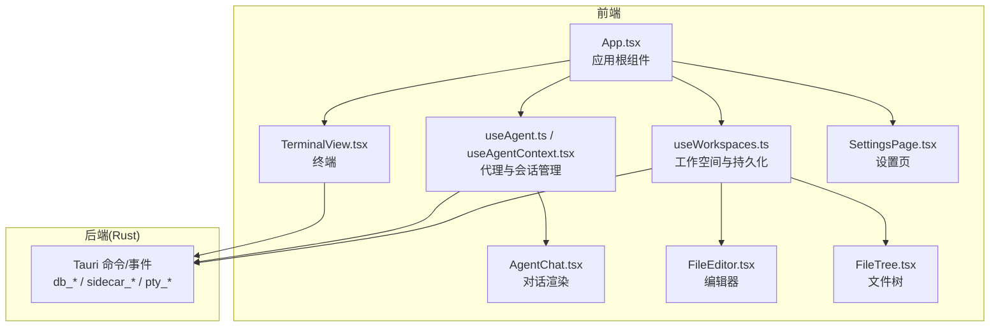
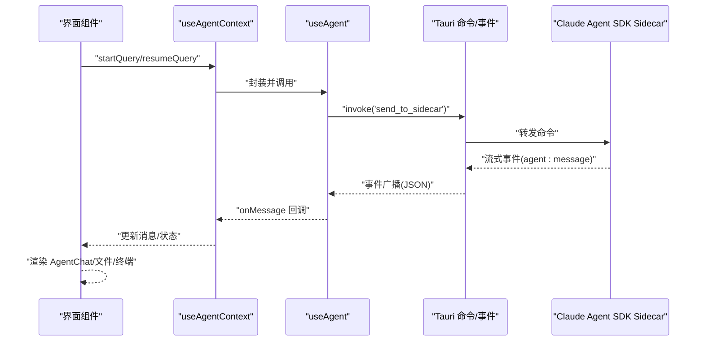
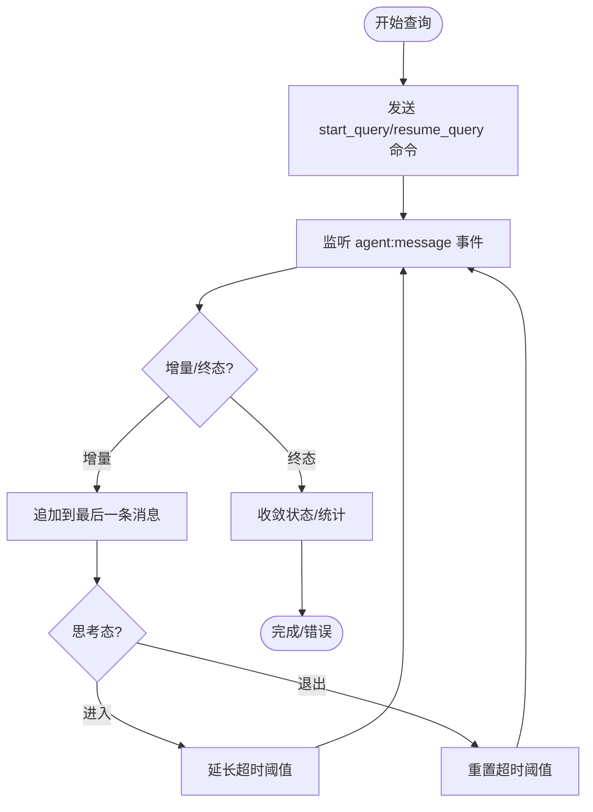
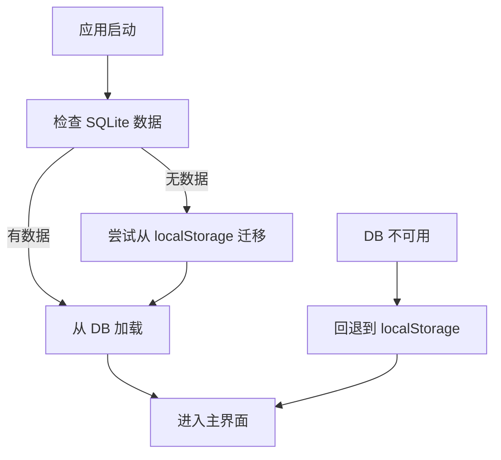
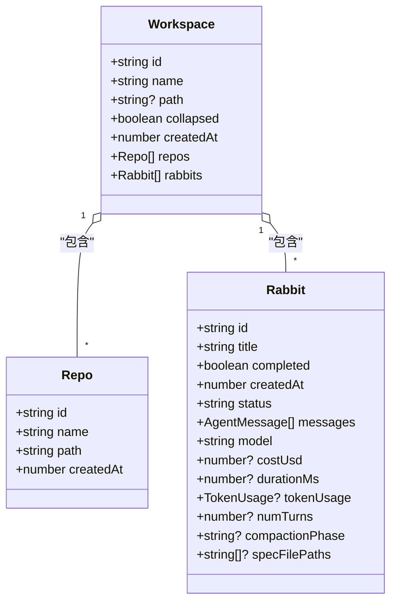
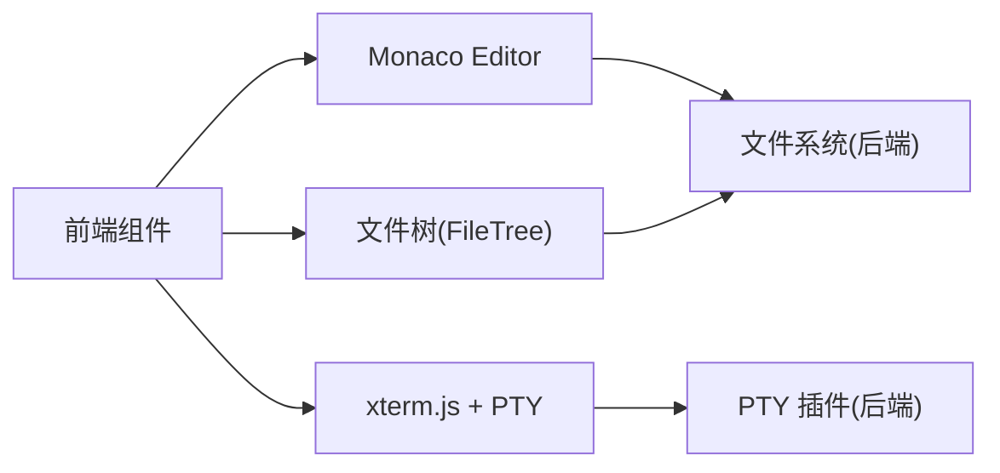
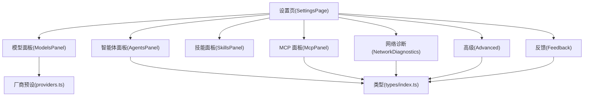
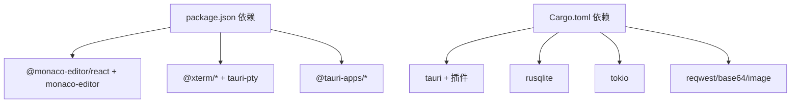

# 核心功能特性

<cite>
**本文引用的文件**
- [README.md](file://README.md)
- [package.json](file://package.json)
- [Cargo.toml](file://src-tauri/Cargo.toml)
- [App.tsx](file://src/App.tsx)
- [main.tsx](file://src/main.tsx)
- [useAgent.ts](file://src/hooks/useAgent.ts)
- [useAgentContext.tsx](file://src/hooks/useAgentContext.tsx)
- [useWorkspaces.ts](file://src/hooks/useWorkspaces.ts)
- [AgentChat.tsx](file://src/components/agent/AgentChat.tsx)
- [FileEditor.tsx](file://src/components/files/FileEditor.tsx)
- [SettingsPage.tsx](file://src/components/settings/SettingsPage.tsx)
- [TerminalView.tsx](file://src/components/terminal/TerminalView.tsx)
- [FileTree.tsx](file://src/components/files/FileTree.tsx)
- [types/index.ts](file://src/types/index.ts)
- [providers.ts](file://src/constants/providers.ts)
</cite>

## 目录
1. [简介](#简介)
2. [项目结构](#项目结构)
3. [核心组件](#核心组件)
4. [架构总览](#架构总览)
5. [详细组件分析](#详细组件分析)
6. [依赖关系分析](#依赖关系分析)
7. [性能考量](#性能考量)
8. [故障排查指南](#故障排查指南)
9. [结论](#结论)
10. [附录](#附录)

## 简介
本文件面向 RabbitCoding 项目，系统性阐述其核心功能特性与实现要点，包括：
- AI 编程助手：智能代码生成、代码解释与重构、多模型支持
- 本地化处理：数据隐私保护、本地计算、离线可靠性
- 工作空间管理：多项目支持、仓库管理、会话历史
- 开发工具集成：内置 Monaco Editor、终端模拟器、文件管理器
- 设置与配置：模型配置、智能体配置、网络设置

## 项目结构
RabbitCoding 采用 Tauri + React + TypeScript 技术栈，前端以 Vite 构建，后端 Rust 通过 Tauri 插件与原生能力交互。核心模块分布如下：
- 前端入口与布局：App.tsx、main.tsx
- 代理与会话：useAgent.ts、useAgentContext.tsx、AgentChat.tsx
- 工作空间与持久化：useWorkspaces.ts、types/index.ts
- 开发工具：Monaco Editor（FileEditor.tsx）、终端（TerminalView.tsx）、文件树（FileTree.tsx）
- 设置与配置：SettingsPage.tsx、providers.ts、types/index.ts
- 后端能力：src-tauri/Cargo.toml 中声明的插件与能力

图表来源
- [App.tsx:30-104](file://src/App.tsx#L30-L104)
- [useWorkspaces.ts:28-541](file://src/hooks/useWorkspaces.ts#L28-L541)
- [useAgent.ts:53-334](file://src/hooks/useAgent.ts#L53-L334)
- [useAgentContext.tsx:88-285](file://src/hooks/useAgentContext.tsx#L88-L285)
- [AgentChat.tsx:87-215](file://src/components/agent/AgentChat.tsx#L87-L215)
- [FileEditor.tsx:121-182](file://src/components/files/FileEditor.tsx#L121-L182)
- [TerminalView.tsx:15-48](file://src/components/terminal/TerminalView.tsx#L15-L48)
- [SettingsPage.tsx:90-228](file://src/components/settings/SettingsPage.tsx#L90-L228)
- [FileTree.tsx:13-39](file://src/components/files/FileTree.tsx#L13-L39)

章节来源
- [README.md:1-8](file://README.md#L1-L8)
- [package.json:1-46](file://package.json#L1-L46)
- [Cargo.toml:1-40](file://src-tauri/Cargo.toml#L1-L40)

## 核心组件
- 代理与会话（useAgent/useAgentContext）：负责与 Claude Agent SDK Sidecar 通信，处理流式消息、超时与压缩、用户提问等。
- 工作空间（useWorkspaces）：提供工作空间、仓库、Rabbit（会话）的增删改查与持久化，支持 SQLite/本地存储双轨降级。
- 编辑器（Monaco Editor）：本地 Worker、离线可用、多语言支持。
- 终端（xterm.js + PTY）：通过 Tauri PTY 插件挂载终端，支持主题与适配。
- 设置（SettingsPage）：集中管理模型、智能体、MCP、技能、网络诊断、高级与反馈。

章节来源
- [useAgent.ts:53-334](file://src/hooks/useAgent.ts#L53-L334)
- [useAgentContext.tsx:88-285](file://src/hooks/useAgentContext.tsx#L88-L285)
- [useWorkspaces.ts:28-541](file://src/hooks/useWorkspaces.ts#L28-L541)
- [FileEditor.tsx:121-182](file://src/components/files/FileEditor.tsx#L121-L182)
- [TerminalView.tsx:15-48](file://src/components/terminal/TerminalView.tsx#L15-L48)
- [SettingsPage.tsx:90-228](file://src/components/settings/SettingsPage.tsx#L90-L228)

## 架构总览
RabbitCoding 的前后端交互遵循“前端 React + Hooks 管理状态，后端 Rust 通过 Tauri Commands/Events 提供能力”的模式。AI 编程助手通过 Sidecar 进程承载，前端通过 invoke 与监听事件实现流式对话；工作空间数据持久化在 SQLite 或本地存储之间动态切换；开发工具（编辑器、终端）均强调本地化与离线可靠性。

图表来源
- [useAgent.ts:262-321](file://src/hooks/useAgent.ts#L262-L321)
- [useAgentContext.tsx:92-193](file://src/hooks/useAgentContext.tsx#L92-L193)
- [AgentChat.tsx:87-215](file://src/components/agent/AgentChat.tsx#L87-L215)

## 详细组件分析

### AI 编程助手：智能代码生成、解释与重构、多模型支持
- 会话生命周期与流式输出
  - 启动/恢复查询：通过 startQuery/resumeQuery 发送命令，携带模型、工具集、权限模式、预算等选项。
  - 流式增量：text_delta/thinking_delta 逐条追加，最终以 text_done/thinking_done 结束信号收尾。
  - 终态收敛：result/error 用于标记成功/失败、成本、时长、token 使用等。
- 会话压缩与超时控制
  - 支持手动 compactQuery，触发会话压缩；压缩状态通过 compaction/compaction_result 消息驱动。
  - 查询看门狗：普通态 10 分钟、思考态 30 分钟，避免静默卡死；sidecar 进程退出或超时统一收敛为 error。
- 用户提问与应答
  - ask_user_question 消息用于向用户收集输入；前端先更新状态，再通过 respond_tool_request 发送答案或取消。
- 多模型支持
  - 模型配置包含厂商、baseUrl、apiKeyEnvVar、自定义 envVars、最大上下文等；支持厂商预设与自定义。
  - 模型连接测试通过 Rust 命令返回状态码、延迟、echo 等信息，保障可用性。

图表来源
- [useAgent.ts:156-205](file://src/hooks/useAgent.ts#L156-L205)
- [useAgent.ts:262-321](file://src/hooks/useAgent.ts#L262-L321)
- [useAgentContext.tsx:104-178](file://src/hooks/useAgentContext.tsx#L104-L178)
- [types/index.ts:82-292](file://src/types/index.ts#L82-L292)

章节来源
- [useAgent.ts:53-334](file://src/hooks/useAgent.ts#L53-L334)
- [useAgentContext.tsx:88-285](file://src/hooks/useAgentContext.tsx#L88-L285)
- [AgentChat.tsx:87-215](file://src/components/agent/AgentChat.tsx#L87-L215)
- [types/index.ts:82-292](file://src/types/index.ts#L82-L292)
- [providers.ts:14-62](file://src/constants/providers.ts#L14-L62)

使用场景与价值
- 智能代码生成：在指定工作空间内，基于仓库与上下文生成代码，支持流式输出与工具调用。
- 代码解释与重构：通过 ask_user_question 与工具链协作，引导用户决策，逐步完成重构。
- 多模型支持：快速切换不同厂商模型，结合预算与权限策略，满足不同场景需求。

### 本地化处理机制：数据隐私与本地计算
- 数据持久化与降级
  - 首选 SQLite 存储，首次启动尝试从 localStorage 迁移；DB 不可用时回退到 localStorage。
  - 双层防抖保存（500ms 延迟 + 3s 强制保存）与周期性写入，兼顾性能与一致性。
- 本地计算与离线可靠性
  - Monaco Editor 完全本地 Worker，不依赖 CDN，确保离线可用与全语言支持。
  - 终端通过 PTY 插件在本地创建伪终端，避免云端依赖。
- 进程健壮性
  - Sidecar 进程退出或超时，统一收敛为 error，避免 UI 永远 loading。

图表来源
- [useWorkspaces.ts:48-95](file://src/hooks/useWorkspaces.ts#L48-L95)
- [useWorkspaces.ts:101-129](file://src/hooks/useWorkspaces.ts#L101-L129)
- [FileEditor.tsx:13-35](file://src/components/files/FileEditor.tsx#L13-L35)
- [TerminalView.tsx:15-48](file://src/components/terminal/TerminalView.tsx#L15-L48)

章节来源
- [useWorkspaces.ts:28-541](file://src/hooks/useWorkspaces.ts#L28-L541)
- [FileEditor.tsx:121-182](file://src/components/files/FileEditor.tsx#L121-L182)
- [TerminalView.tsx:15-48](file://src/components/terminal/TerminalView.tsx#L15-L48)

### 工作空间管理：多项目、仓库与会话历史
- 多项目与会话
  - 支持添加/删除/重命名工作空间，切换选中工作空间与 Rabbit。
  - Rabbit 支持置顶、完成状态、消息流、token 统计、压缩阶段等。
- 仓库管理
  - 添加/删除/更新仓库，自动确保 docs 目录存在。
- 会话历史
  - 消息去重（result 类型仅保留最后一条）、流式增量合并、自动滚动至底部。
  - 支持 spec 文档生成流程（生成中/确认/写入）与压缩状态展示。

图表来源
- [types/index.ts:34-42](file://src/types/index.ts#L34-L42)
- [types/index.ts:1-6](file://src/types/index.ts#L1-L6)
- [types/index.ts:8-32](file://src/types/index.ts#L8-L32)

章节来源
- [useWorkspaces.ts:28-541](file://src/hooks/useWorkspaces.ts#L28-L541)
- [AgentChat.tsx:87-215](file://src/components/agent/AgentChat.tsx#L87-L215)
- [types/index.ts:82-292](file://src/types/index.ts#L82-L292)

### 开发工具集成：Monaco Editor、终端模拟器、文件管理器
- Monaco Editor
  - 本地 Worker、主题随系统/主题切换；根据文件扩展名自动识别语言；可配置只读、行号、自动布局等。
- 终端模拟器
  - 通过 xterm.js 与 PTY 插件集成，支持 fit、主题、错误提示与就绪回调。
- 文件管理器
  - 文件树组件支持展开/折叠、选中高亮、路径显示；与编辑器联动。

图表来源
- [FileEditor.tsx:121-182](file://src/components/files/FileEditor.tsx#L121-L182)
- [TerminalView.tsx:15-48](file://src/components/terminal/TerminalView.tsx#L15-L48)
- [FileTree.tsx:13-39](file://src/components/files/FileTree.tsx#L13-L39)
- [Cargo.toml:26-32](file://src-tauri/Cargo.toml#L26-L32)

章节来源
- [FileEditor.tsx:121-182](file://src/components/files/FileEditor.tsx#L121-L182)
- [TerminalView.tsx:15-48](file://src/components/terminal/TerminalView.tsx#L15-L48)
- [FileTree.tsx:13-39](file://src/components/files/FileTree.tsx#L13-L39)

### 设置与配置：模型、智能体、网络
- 模型配置
  - 厂商预设（glm/minimax/aliyun/kimi/deepseek/custom）与自定义模型；支持连接测试、最大上下文等。
- 智能体配置
  - 内置专家角色与自定义智能体，支持工具集、系统提示词、启用状态。
- MCP 服务
  - 支持 stdio/http/sse 三种传输类型，可配置命令/URL、参数/头部、环境变量。
- 网络诊断
  - 代理检测、DNS/Ping/HTTP/MCP 诊断，输出状态与错误信息，辅助定位网络问题。
- 高级与反馈
  - 高级设置与反馈提交，包含系统信息、配置摘要、性能指标等。

图表来源
- [SettingsPage.tsx:90-228](file://src/components/settings/SettingsPage.tsx#L90-L228)
- [providers.ts:14-62](file://src/constants/providers.ts#L14-L62)
- [types/index.ts:317-451](file://src/types/index.ts#L317-L451)

章节来源
- [SettingsPage.tsx:90-228](file://src/components/settings/SettingsPage.tsx#L90-L228)
- [providers.ts:14-62](file://src/constants/providers.ts#L14-L62)
- [types/index.ts:317-451](file://src/types/index.ts#L317-L451)

## 依赖关系分析
- 前端依赖
  - @monaco-editor/react、monaco-editor：本地化编辑器
  - @xterm/*、tauri-pty：终端与 PTY
  - @tauri-apps/*：Tauri 插件生态
- 后端依赖
  - tauri、tauri-plugin-*：窗口、FS、Shell、PTY、通知、深链等
  - rusqlite、tokio：SQLite 与异步运行时
  - reqwest/base64/image：网络与图像处理

图表来源
- [package.json:14-36](file://package.json#L14-L36)
- [Cargo.toml:20-39](file://src-tauri/Cargo.toml#L20-L39)

章节来源
- [package.json:14-36](file://package.json#L14-L36)
- [Cargo.toml:20-39](file://src-tauri/Cargo.toml#L20-L39)

## 性能考量
- 会话性能
  - 流式增量渲染减少重排；思考态延长超时避免误判；压缩阶段可视化提示。
- 存储性能
  - 双层防抖与周期性保存降低写入频率；DB 不可用时回退 localStorage。
- 编辑器与终端
  - Monaco Editor 自动布局与最小化渲染；终端 fit 与错误提示避免阻塞。
- 网络诊断
  - 并行诊断与状态聚合，便于快速定位瓶颈。

## 故障排查指南
- 会话无响应
  - 检查 sidecar 状态与超时日志；查看 AgentChat 的“运行中/压缩中”状态提示。
- 侧车退出或超时
  - 查看兜底收敛逻辑，确认是否被标记为 error；必要时重新启动 sidecar。
- 模型不可用
  - 使用模型连接测试面板，核对状态码、延迟与 echo；检查 API Key 与环境变量。
- 网络问题
  - 使用网络诊断面板检查代理、DNS、Ping、HTTP 与 MCP 服务可达性。
- 终端无法启动
  - 查看错误提示与日志；确认 PTY 插件可用与权限。

章节来源
- [useAgent.ts:66-101](file://src/hooks/useAgent.ts#L66-L101)
- [useAgentContext.tsx:180-192](file://src/hooks/useAgentContext.tsx#L180-L192)
- [SettingsPage.tsx:125-127](file://src/components/settings/SettingsPage.tsx#L125-L127)
- [TerminalView.tsx:32-44](file://src/components/terminal/TerminalView.tsx#L32-L44)

## 结论
RabbitCoding 通过“本地优先”的设计，在保障数据隐私的同时，提供了强大的 AI 编程助手与开发工具链。其工作空间与会话管理、多模型与智能体配置、以及网络诊断与设置面板，共同构成了一个面向生产的本地化编程环境。建议在团队协作中结合仓库管理与知识库索引，进一步提升研发效率与质量。

## 附录
- 快速上手
  - 启动应用后，进入设置页配置模型与智能体；在工作空间中添加仓库与 Rabbit；使用编辑器与终端进行日常开发；通过 AI 助手完成代码生成与重构。
- 最佳实践
  - 使用压缩功能控制上下文长度；合理设置预算与权限；定期检查网络诊断与代理配置；利用会话历史与知识库沉淀经验。