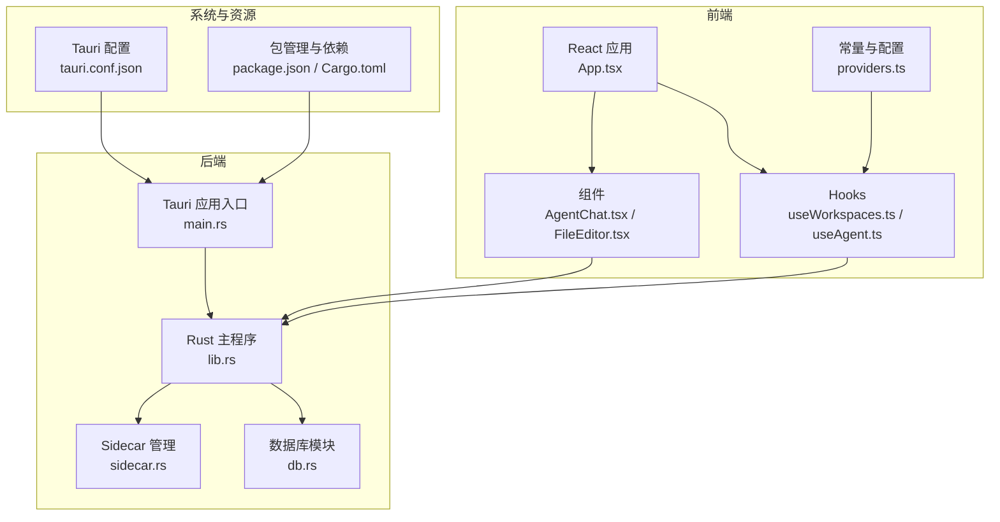
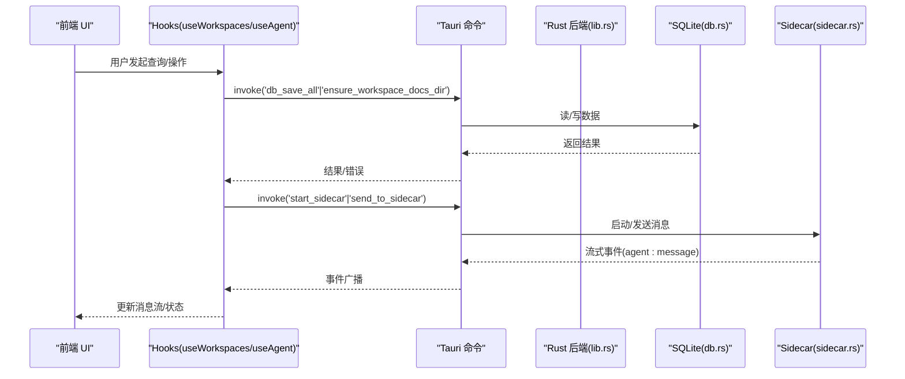
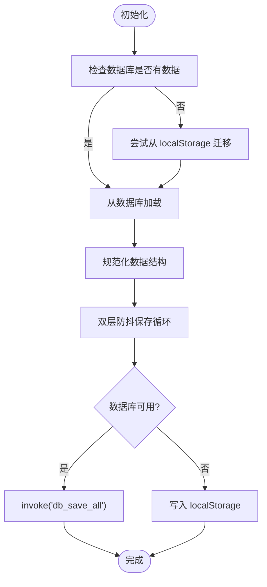
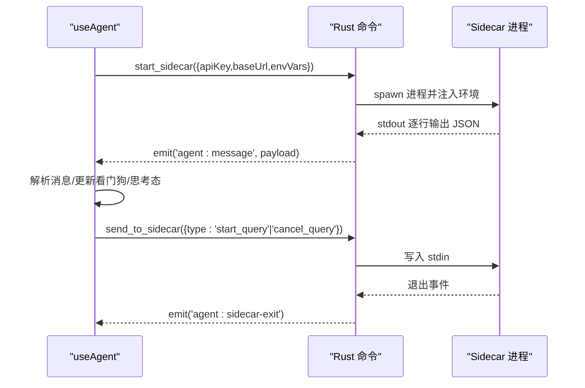
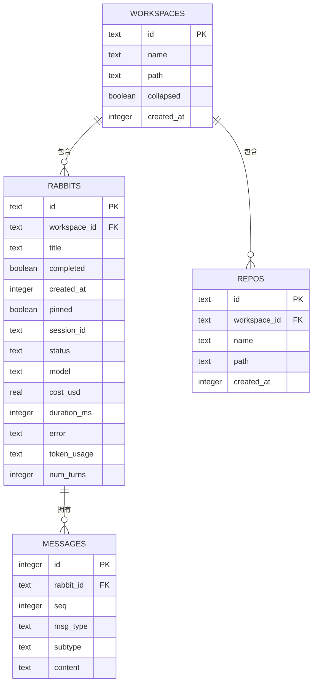
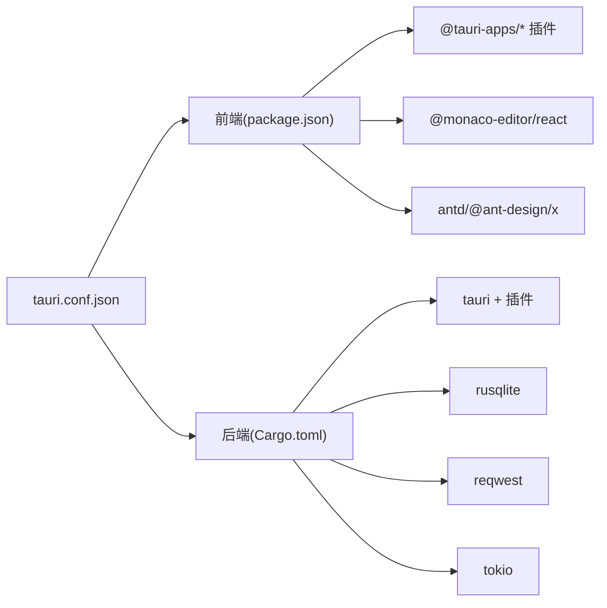

# 项目介绍

<cite>
**本文档引用的文件**
- [README.md](file://README.md)
- [package.json](file://package.json)
- [Cargo.toml](file://src-tauri/Cargo.toml)
- [tauri.conf.json](file://src-tauri/tauri.conf.json)
- [main.tsx](file://src/main.tsx)
- [App.tsx](file://src/App.tsx)
- [useWorkspaces.ts](file://src/hooks/useWorkspaces.ts)
- [useAgent.ts](file://src/hooks/useAgent.ts)
- [AgentChat.tsx](file://src/components/agent/AgentChat.tsx)
- [FileEditor.tsx](file://src/components/files/FileEditor.tsx)
- [providers.ts](file://src/constants/providers.ts)
- [lib.rs](file://src-tauri/src/lib.rs)
- [db.rs](file://src-tauri/src/db.rs)
- [sidecar.rs](file://src-tauri/src/sidecar.rs)
- [main.rs](file://src-tauri/src/main.rs)
</cite>

## 目录
1. [简介](#简介)
2. [项目结构](#项目结构)
3. [核心组件](#核心组件)
4. [架构总览](#架构总览)
5. [详细组件分析](#详细组件分析)
6. [依赖关系分析](#依赖关系分析)
7. [性能考量](#性能考量)
8. [故障排查指南](#故障排查指南)
9. [结论](#结论)
10. [附录](#附录)

## 简介
RabbitCoding 是一款基于 Tauri + React + TypeScript 的智能代码助手桌面应用，专注于为开发者提供本地化的 AI 编程辅助能力。其核心价值主张包括：
- 隐私优先：所有数据与处理过程均在本地完成，不上传至云端，保障用户代码与上下文的安全性。
- 智能编程：通过 Claude Agent SDK Sidecar 实现智能代码生成、解释与协作，支持多轮对话与工具调用。
- 多模型支持：内置多家模型厂商的预设与自定义配置，便于快速切换与测试不同模型。
- 工作空间管理：提供工作区与 Rabbit（任务）的组织与持久化，支持仓库绑定、消息流与状态追踪。
- 本地化体验：集成本地文件编辑器、终端、通知与网络诊断，满足从开发到验证的全流程需求。

目标用户群体：
- 软件工程师与程序员：需要在本地环境中高效编写、审查与优化代码。
- AI 爱好者与研究者：希望在可控环境下探索多模型与工具链组合，进行实验与评测。

项目解决的问题与价值：
- 解决远程模型访问的隐私与延迟问题，降低对外部网络的依赖。
- 提供可追溯、可审计的本地化对话与操作记录，便于团队知识沉淀与复用。
- 通过工作空间与 Rabbit 的结构化管理，提升复杂任务的协作效率与一致性。

愿景与使命：
- 愿景：成为开发者身边的本地智能伙伴，让 AI 编程更安全、更可控、更高效。
- 使命：以本地化为核心，构建可扩展、可定制、可信任的智能编程基础设施。

## 项目结构
项目采用前后端分离的桌面应用架构：
- 前端（React + TypeScript）：负责 UI、交互、国际化、主题与视图路由。
- 后端（Rust + Tauri）：负责本地数据库、文件系统、进程管理、系统集成与安全隔离。
- Sidecar（Node/TypeScript）：作为 Claude Agent SDK 的本地侧车进程，承载模型推理与工具调用。

**图表来源**
- [main.tsx:1-11](file://src/main.tsx#L1-L11)
- [App.tsx:1-102](file://src/App.tsx#L1-L102)
- [useWorkspaces.ts:1-541](file://src/hooks/useWorkspaces.ts#L1-L541)
- [useAgent.ts:1-334](file://src/hooks/useAgent.ts#L1-L334)
- [AgentChat.tsx:1-215](file://src/components/agent/AgentChat.tsx#L1-L215)
- [FileEditor.tsx:1-182](file://src/components/files/FileEditor.tsx#L1-L182)
- [providers.ts:1-63](file://src/constants/providers.ts#L1-L63)
- [main.rs:1-7](file://src-tauri/src/main.rs#L1-L7)
- [lib.rs:125-317](file://src-tauri/src/lib.rs#L125-L317)
- [db.rs:1-417](file://src-tauri/src/db.rs#L1-L417)
- [sidecar.rs:1-359](file://src-tauri/src/sidecar.rs#L1-L359)
- [tauri.conf.json:1-52](file://src-tauri/tauri.conf.json#L1-L52)
- [package.json:1-46](file://package.json#L1-L46)
- [Cargo.toml:1-40](file://src-tauri/Cargo.toml#L1-L40)

**章节来源**
- [main.tsx:1-11](file://src/main.tsx#L1-L11)
- [App.tsx:1-102](file://src/App.tsx#L1-L102)
- [tauri.conf.json:1-52](file://src-tauri/tauri.conf.json#L1-L52)
- [package.json:1-46](file://package.json#L1-L46)
- [Cargo.toml:1-40](file://src-tauri/Cargo.toml#L1-L40)

## 核心组件
- 工作空间与 Rabbit 管理：通过 useWorkspaces 提供工作区、仓库与任务（Rabbit）的增删改查、状态持久化与消息流管理。
- Agent 通信与 Sidecar：通过 useAgent 管理与 Claude Agent SDK Sidecar 的连接、查询生命周期与事件监听。
- 本地存储与数据库：Rust 层提供 SQLite 数据库封装，支持全量导入/导出与事务性写入。
- 文件编辑与终端：集成 Monaco 编辑器与 xterm，提供本地文件编辑与终端交互。
- 模型与厂商配置：内置多家模型厂商预设，支持自定义 BaseURL 与 API Key 环境变量。

**章节来源**
- [useWorkspaces.ts:1-541](file://src/hooks/useWorkspaces.ts#L1-L541)
- [useAgent.ts:1-334](file://src/hooks/useAgent.ts#L1-L334)
- [db.rs:1-417](file://src-tauri/src/db.rs#L1-L417)
- [FileEditor.tsx:1-182](file://src/components/files/FileEditor.tsx#L1-L182)
- [providers.ts:1-63](file://src/constants/providers.ts#L1-L63)

## 架构总览
RabbitCoding 的整体架构围绕“本地化 + 事件驱动 + 会话状态”展开：
- 前端通过 Tauri 命令与 Rust 后端交互，实现数据库读写、文件系统操作与系统集成。
- Rust 后端启动并管理 Sidecar 进程，将模型请求转发给 Sidecar，并将流式事件回传前端。
- 前端 Hooks 负责状态收敛、消息去重与流式渲染，确保 UI 与会话状态一致。

**图表来源**
- [lib.rs:272-313](file://src-tauri/src/lib.rs#L272-L313)
- [db.rs:392-416](file://src-tauri/src/db.rs#L392-L416)
- [sidecar.rs:60-214](file://src-tauri/src/sidecar.rs#L60-L214)
- [useWorkspaces.ts:100-129](file://src/hooks/useWorkspaces.ts#L100-L129)
- [useAgent.ts:106-177](file://src/hooks/useAgent.ts#L106-L177)

## 详细组件分析

### 工作空间与 Rabbit 生命周期
- 数据加载与降级：首次启动检查数据库是否存在数据，不存在则尝试从 localStorage 迁移；数据库不可用时回退到 localStorage。
- 双层防抖保存：500ms 延迟保存与 3s 周期保存，兼顾响应速度与流式输出稳定性。
- Rabbit 状态与消息：支持状态收敛（运行中→空闲）、消息去重（result 类型）、增量文本追加与思考态时长统计。

**图表来源**
- [useWorkspaces.ts:48-95](file://src/hooks/useWorkspaces.ts#L48-L95)
- [useWorkspaces.ts:100-129](file://src/hooks/useWorkspaces.ts#L100-L129)
- [useWorkspaces.ts:131-147](file://src/hooks/useWorkspaces.ts#L131-L147)

**章节来源**
- [useWorkspaces.ts:1-541](file://src/hooks/useWorkspaces.ts#L1-L541)

### Agent 通信与 Sidecar 管理
- Sidecar 启动：清理环境变量污染、重定向 Claude 配置根目录、注入 API Key/BaseURL/自定义环境变量，启动 stdout/stderr 监听线程。
- 查询生命周期：startQuery/resumeQuery/compactQuery/cancelQuery，配合看门狗与思考态阈值，避免静默卡死。
- 事件处理：解析 agent:message 事件，区分思考态进入/退出，重置看门狗；sidecar 退出时统一清理。

**图表来源**
- [sidecar.rs:60-214](file://src-tauri/src/sidecar.rs#L60-L214)
- [useAgent.ts:106-177](file://src/hooks/useAgent.ts#L106-L177)
- [useAgent.ts:262-320](file://src/hooks/useAgent.ts#L262-L320)

**章节来源**
- [useAgent.ts:1-334](file://src/hooks/useAgent.ts#L1-L334)
- [sidecar.rs:1-359](file://src-tauri/src/sidecar.rs#L1-L359)

### 本地数据库与持久化
- Schema 设计：workspaces、rabbits、repos、messages 四表，外键约束与索引优化。
- 读写流程：load_all 将多表聚合为 Workspace[] JSON；save_all 以事务方式全量替换，保证一致性。
- 迁移与兼容：列迁移（token_usage、num_turns）与默认值处理，向前兼容历史版本。

**图表来源**
- [db.rs:85-138](file://src-tauri/src/db.rs#L85-L138)
- [db.rs:167-288](file://src-tauri/src/db.rs#L167-L288)
- [db.rs:290-386](file://src-tauri/src/db.rs#L290-L386)

**章节来源**
- [db.rs:1-417](file://src-tauri/src/db.rs#L1-L417)

### 文件编辑器与本地化
- Monaco 配置：本地 worker 注入，避免 CDN 依赖，支持多语言高亮与主题切换。
- 语言识别：根据文件扩展名映射到对应语言，覆盖常见开发语言与脚本格式。
- 只读与编辑：通过 editable 控制编辑能力，选项包含行号、最小化、自动布局等。

**章节来源**
- [FileEditor.tsx:1-182](file://src/components/files/FileEditor.tsx#L1-L182)

### 模型与厂商配置
- 厂商预设：内置多家模型厂商的 baseUrl、默认模型与 API Key 环境变量，一键填充。
- 自定义模型：支持自定义厂商与空缺字段，便于接入第三方或私有化部署。

**章节来源**
- [providers.ts:1-63](file://src/constants/providers.ts#L1-L63)

## 依赖关系分析
- 前端依赖：React、Ant Design、Monaco Editor、TailwindCSS、@tauri-apps/* 插件生态。
- 后端依赖：Tauri、rusqlite、reqwest、tokio、image、xcap、sysinfo 等。
- 构建与打包：Vite + TypeScript 前端构建，Tauri CLI + rustc 后端构建，打包图标与 sidecar 资源。

**图表来源**
- [package.json:14-36](file://package.json#L14-L36)
- [Cargo.toml:20-39](file://src-tauri/Cargo.toml#L20-L39)
- [tauri.conf.json:6-11](file://src-tauri/tauri.conf.json#L6-L11)

**章节来源**
- [package.json:1-46](file://package.json#L1-L46)
- [Cargo.toml:1-40](file://src-tauri/Cargo.toml#L1-L40)
- [tauri.conf.json:1-52](file://src-tauri/tauri.conf.json#L1-L52)

## 性能考量
- 数据持久化：SQLite WAL 模式、外键与索引优化，事务批量写入减少 I/O 抖动。
- 事件驱动：前端通过事件解耦 UI 与后端，避免频繁重渲染；Sidecar 流式输出按消息类型去重与合并。
- 资源隔离：Sidecar 配置根目录隔离，避免全局资源影响；本地 Node 运行时注入 PATH 与 npm 前缀，减少权限与路径问题。
- UI 响应：双层防抖与周期保存策略，兼顾实时性与稳定性；编辑器与终端按需渲染，降低内存占用。

## 故障排查指南
- 数据库不可用：前端检测到 db_* 命令失败会回退到 localStorage；检查应用数据目录权限与磁盘空间。
- Sidecar 启动失败：确认 API Key/BaseURL 设置正确，清理可能污染的环境变量，查看 stderr 日志定位问题。
- 会话卡死：前端看门狗会在阈值时间内无消息时触发超时回调，进入思考态时延长时间阈值；必要时取消查询并重启 Sidecar。
- 文件读取受限：使用后端命令读取隐藏目录文件，绕过 Tauri fs:scope 限制；确保路径有效且可访问。
- 通知与系统设置：通过后端命令打开系统通知设置页面，跨平台适配 macOS/Windows。

**章节来源**
- [lib.rs:35-60](file://src-tauri/src/lib.rs#L35-L60)
- [lib.rs:65-114](file://src-tauri/src/lib.rs#L65-L114)
- [useAgent.ts:66-101](file://src/hooks/useAgent.ts#L66-L101)
- [sidecar.rs:96-150](file://src-tauri/src/sidecar.rs#L96-L150)

## 结论
RabbitCoding 通过本地化架构与模块化设计，为开发者提供了安全、可控且高效的智能编程体验。其以工作空间与 Rabbit 为主线的状态管理、以 Sidecar 为核心的事件驱动通信、以及以 SQLite 为基础的持久化方案，共同构成了可扩展、可维护的桌面应用框架。未来可在模型评测、插件市场与团队协作方面进一步深化，持续提升用户体验与生产力。

## 附录
- 快速开始：安装依赖后，使用 Tauri CLI 启动开发服务器或构建发布包。
- 配置项：在设置面板中配置模型厂商、API Key、BaseURL 与网络诊断；通过深链 scheme 进行应用集成。
- 资源目录：打包时包含 sidecar 与内置 Node 运行时，确保生产环境可独立运行。

**章节来源**
- [README.md:1-8](file://README.md#L1-L8)
- [tauri.conf.json:26-50](file://src-tauri/tauri.conf.json#L26-L50)
- [lib.rs:154-211](file://src-tauri/src/lib.rs#L154-L211)