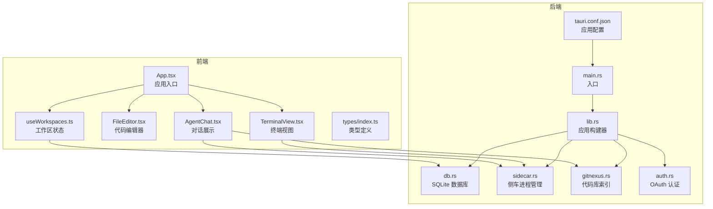
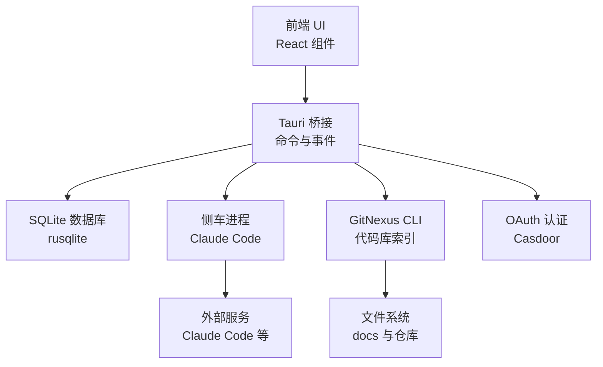
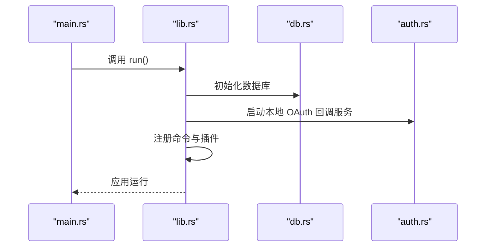
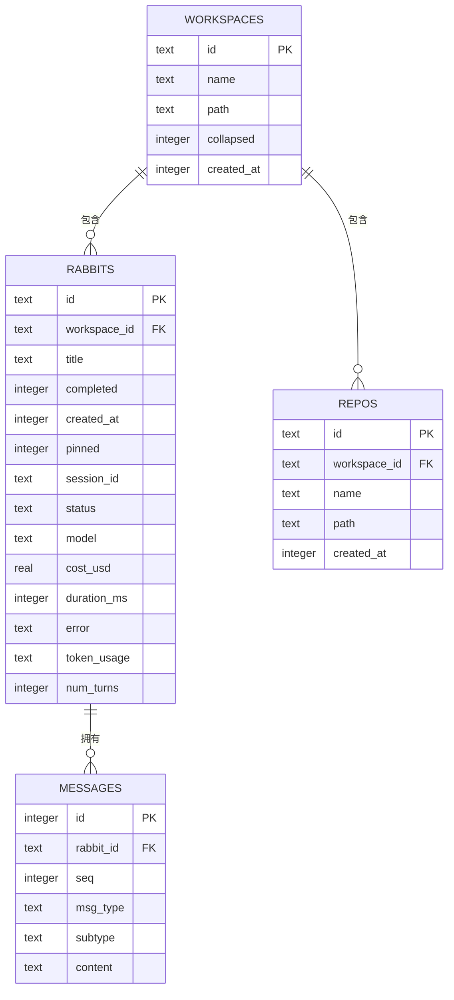
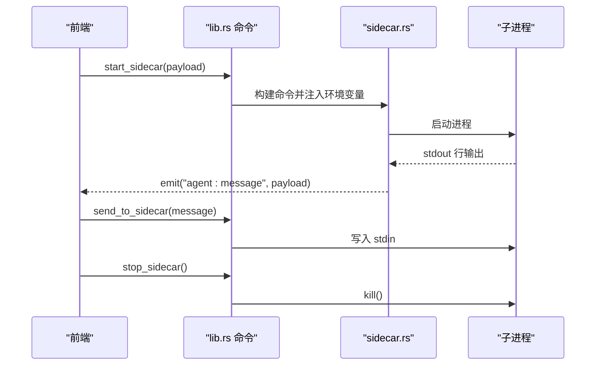
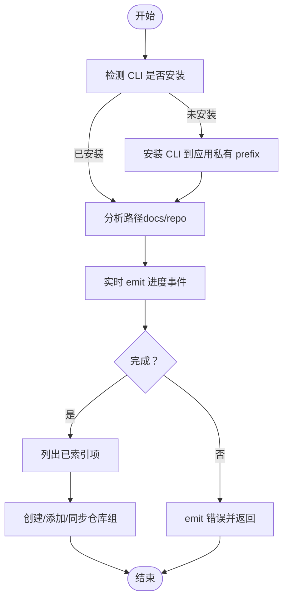
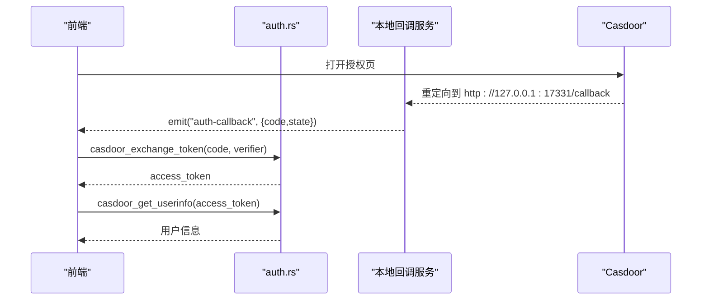
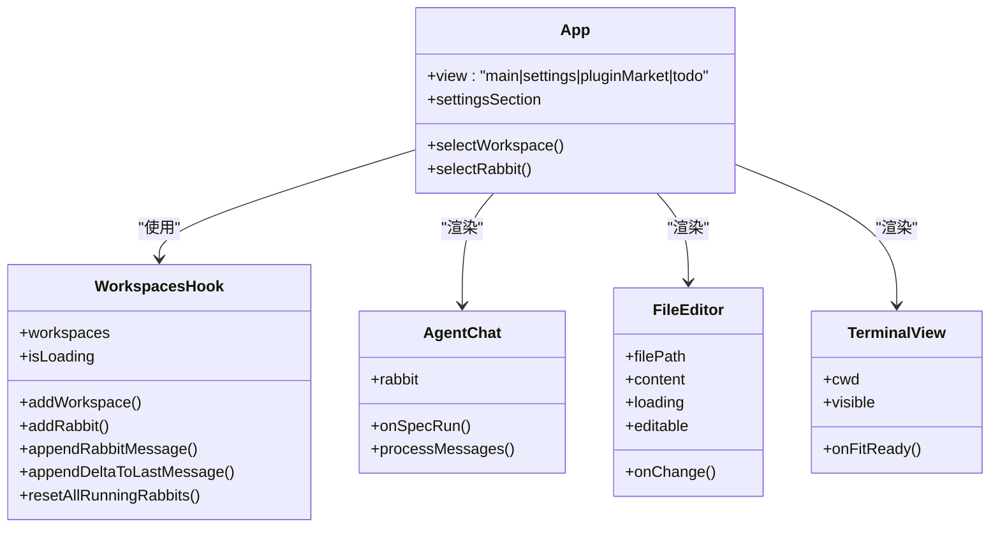
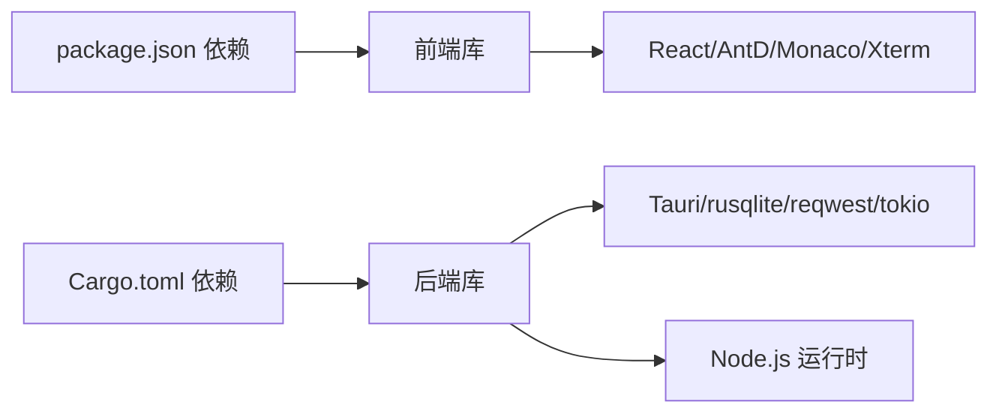

# 项目概述

<cite>
**本文档引用的文件**
- [README.md](file://README.md)
- [package.json](file://package.json)
- [src-tauri/Cargo.toml](file://src-tauri/Cargo.toml)
- [src-tauri/src/main.rs](file://src-tauri/src/main.rs)
- [src-tauri/src/lib.rs](file://src-tauri/src/lib.rs)
- [src-tauri/tauri.conf.json](file://src-tauri/tauri.conf.json)
- [src-tauri/src/sidecar.rs](file://src-tauri/src/sidecar.rs)
- [src-tauri/src/gitnexus.rs](file://src-tauri/src/gitnexus.rs)
- [src-tauri/src/db.rs](file://src-tauri/src/db.rs)
- [src-tauri/src/auth.rs](file://src-tauri/src/auth.rs)
- [src/App.tsx](file://src/App.tsx)
- [src/components/agent/AgentChat.tsx](file://src/components/agent/AgentChat.tsx)
- [src/components/files/FileEditor.tsx](file://src/components/files/FileEditor.tsx)
- [src/components/terminal/TerminalView.tsx](file://src/components/terminal/TerminalView.tsx)
- [src/hooks/useWorkspaces.ts](file://src/hooks/useWorkspaces.ts)
- [src/types/index.ts](file://src/types/index.ts)
- [src/constants/providers.ts](file://src/constants/providers.ts)
</cite>

## 目录
1. [简介](#简介)
2. [项目结构](#项目结构)
3. [核心组件](#核心组件)
4. [架构总览](#架构总览)
5. [详细组件分析](#详细组件分析)
6. [依赖关系分析](#依赖关系分析)
7. [性能考虑](#性能考虑)
8. [故障排除指南](#故障排除指南)
9. [结论](#结论)

## 简介
RabbitCoding 是一款基于 Tauri + React + TypeScript 的智能代码助手桌面应用。它通过本地化的 AI 编程助手、代码库索引与检索、终端模拟、以及工作空间管理，帮助开发者在本地环境中高效地完成从需求分析到代码实现的全流程任务。项目采用跨平台桌面框架 Tauri，结合 React 前端与 Rust 后端，既保证了良好的用户体验，又实现了高性能与安全的本地执行。

## 项目结构
项目采用前后端分离的组织方式：
- 前端（React + TypeScript）位于 src/ 目录，负责 UI、交互与状态管理。
- 后端（Rust）位于 src-tauri/ 目录，负责系统集成、数据库、认证、侧车进程管理与网络诊断等。
- sidecar/ 目录包含与主应用协同的 Node.js 侧车进程，负责与 Claude Code 等外部服务通信。

**图表来源**
- [src-tauri/src/main.rs:1-7](file://src-tauri/src/main.rs#L1-L7)
- [src-tauri/src/lib.rs:124-316](file://src-tauri/src/lib.rs#L124-L316)
- [src-tauri/src/db.rs:80-161](file://src-tauri/src/db.rs#L80-L161)
- [src-tauri/src/sidecar.rs:59-359](file://src-tauri/src/sidecar.rs#L59-L359)
- [src-tauri/src/gitnexus.rs:176-761](file://src-tauri/src/gitnexus.rs#L176-L761)
- [src-tauri/src/auth.rs:247-376](file://src-tauri/src/auth.rs#L247-L376)
- [src-tauri/tauri.conf.json:1-52](file://src-tauri/tauri.conf.json#L1-L52)
- [src/App.tsx:29-99](file://src/App.tsx#L29-L99)
- [src/hooks/useWorkspaces.ts:28-541](file://src/hooks/useWorkspaces.ts#L28-L541)
- [src/components/agent/AgentChat.tsx:87-215](file://src/components/agent/AgentChat.tsx#L87-L215)
- [src/components/files/FileEditor.tsx:121-182](file://src/components/files/FileEditor.tsx#L121-L182)
- [src/components/terminal/TerminalView.tsx:15-48](file://src/components/terminal/TerminalView.tsx#L15-L48)

**章节来源**
- [README.md:1-8](file://README.md#L1-L8)
- [package.json:1-46](file://package.json#L1-L46)
- [src-tauri/Cargo.toml:1-40](file://src-tauri/Cargo.toml#L1-L40)
- [src-tauri/tauri.conf.json:1-52](file://src-tauri/tauri.conf.json#L1-L52)

## 核心组件
- 应用入口与构建器：Rust 入口文件负责初始化应用、注册插件与命令，并在开发与生产环境下注入 Node.js 运行时与侧车资源。
- 数据持久化：基于 SQLite 的数据库模块，提供工作区、兔子（任务）、仓库与消息的结构化存储与迁移。
- 侧车进程管理：负责启动、停止与通信 Claude Code 等外部服务，隔离全局配置，确保安全与一致性。
- 代码库索引：通过 GitNexus CLI 对 docs 与仓库进行索引与同步，支持组维度的契约抽取。
- 认证与授权：基于 Casdoor 的 OAuth 流程，使用本地 loopback 回调服务，简化登录体验。
- 前端状态与 UI：React Hooks 管理工作区与任务状态，组件负责对话展示、文件编辑与终端模拟。

**章节来源**
- [src-tauri/src/main.rs:4-6](file://src-tauri/src/main.rs#L4-L6)
- [src-tauri/src/lib.rs:124-316](file://src-tauri/src/lib.rs#L124-L316)
- [src-tauri/src/db.rs:140-161](file://src-tauri/src/db.rs#L140-L161)
- [src-tauri/src/sidecar.rs:59-359](file://src-tauri/src/sidecar.rs#L59-L359)
- [src-tauri/src/gitnexus.rs:176-761](file://src-tauri/src/gitnexus.rs#L176-L761)
- [src-tauri/src/auth.rs:247-376](file://src-tauri/src/auth.rs#L247-L376)
- [src/App.tsx:29-99](file://src/App.tsx#L29-L99)

## 架构总览
RabbitCoding 采用“前端 React + 后端 Rust + 侧车 Node.js”三层架构：
- 前端通过 Tauri 暴露的命令与事件与后端交互，实现 UI 与业务逻辑解耦。
- 后端通过 SQLite 存储应用数据，通过侧车进程与外部服务通信，通过 GitNexus 实现代码库索引能力。
- 认证流程通过本地 loopback HTTP 服务器接收 OAuth 回调，避免复杂平台配置。

**图表来源**
- [src-tauri/src/lib.rs:272-313](file://src-tauri/src/lib.rs#L272-L313)
- [src-tauri/src/db.rs:392-417](file://src-tauri/src/db.rs#L392-L417)
- [src-tauri/src/sidecar.rs:59-359](file://src-tauri/src/sidecar.rs#L59-L359)
- [src-tauri/src/gitnexus.rs:176-761](file://src-tauri/src/gitnexus.rs#L176-L761)
- [src-tauri/src/auth.rs:247-376](file://src-tauri/src/auth.rs#L247-L376)

## 详细组件分析

### 应用入口与生命周期
- 入口文件负责调用应用构建器，初始化数据库、启动本地 OAuth 回调服务、注入 Node.js 运行时与侧车资源，并注册所有命令。
- 窗口状态管理与事件监听，确保窗口尺寸与位置变化时自动保存。

**图表来源**
- [src-tauri/src/main.rs:4-6](file://src-tauri/src/main.rs#L4-L6)
- [src-tauri/src/lib.rs:124-270](file://src-tauri/src/lib.rs#L124-L270)
- [src-tauri/src/db.rs:140-161](file://src-tauri/src/db.rs#L140-L161)
- [src-tauri/src/auth.rs:258-284](file://src-tauri/src/auth.rs#L258-L284)

**章节来源**
- [src-tauri/src/main.rs:4-6](file://src-tauri/src/main.rs#L4-L6)
- [src-tauri/src/lib.rs:124-270](file://src-tauri/src/lib.rs#L124-L270)

### 数据持久化（SQLite）
- 数据库结构包含工作区、兔子（任务）、仓库与消息四张表，支持外键约束与索引优化。
- 提供全量加载与保存命令，支持事务性写入与列迁移，保证数据一致性与向前兼容。

**图表来源**
- [src-tauri/src/db.rs:85-138](file://src-tauri/src/db.rs#L85-L138)
- [src-tauri/src/db.rs:290-386](file://src-tauri/src/db.rs#L290-L386)

**章节来源**
- [src-tauri/src/db.rs:140-161](file://src-tauri/src/db.rs#L140-L161)
- [src-tauri/src/db.rs:392-417](file://src-tauri/src/db.rs#L392-L417)

### 侧车进程管理（Claude Code）
- 通过命令启动/停止/查询侧车进程，注入 API Key、Base URL 与自定义环境变量，隔离全局配置。
- 从侧车 stdout 逐行解析 Agent 事件并通过事件总线广播至前端。

**图表来源**
- [src-tauri/src/lib.rs:272-313](file://src-tauri/src/lib.rs#L272-L313)
- [src-tauri/src/sidecar.rs:59-359](file://src-tauri/src/sidecar.rs#L59-L359)

**章节来源**
- [src-tauri/src/sidecar.rs:59-359](file://src-tauri/src/sidecar.rs#L59-L359)

### 代码库索引（GitNexus）
- 支持安装/卸载/检测 GitNexus CLI，分析 docs 与仓库，列出已索引项，创建与同步仓库组。
- 通过内置 Node.js 与私有 npm prefix，确保与系统环境隔离。

**图表来源**
- [src-tauri/src/gitnexus.rs:180-761](file://src-tauri/src/gitnexus.rs#L180-L761)

**章节来源**
- [src-tauri/src/gitnexus.rs:180-761](file://src-tauri/src/gitnexus.rs#L180-L761)

### 认证与授权（OAuth）
- 通过本地 loopback HTTP 服务接收 OAuth 回调，简化登录流程，避免平台特定配置。
- 提供 token 交换与用户信息获取的组合命令，减少前端往返。

**图表来源**
- [src-tauri/src/auth.rs:258-376](file://src-tauri/src/auth.rs#L258-L376)

**章节来源**
- [src-tauri/src/auth.rs:258-376](file://src-tauri/src/auth.rs#L258-L376)

### 前端状态与 UI 组件
- App.tsx 作为应用入口，整合主题、国际化、工作区与智能体上下文，控制视图切换。
- useWorkspaces.ts 管理工作区、任务与消息的状态，提供双层防抖保存与兼容性处理。
- AgentChat.tsx 负责对话渲染、消息分组与流式输出处理。
- FileEditor.tsx 基于 Monaco Editor 提供本地化编辑体验。
- TerminalView.tsx 集成 xterm.js 与 PTY，提供终端模拟。

**图表来源**
- [src/App.tsx:29-99](file://src/App.tsx#L29-L99)
- [src/hooks/useWorkspaces.ts:28-541](file://src/hooks/useWorkspaces.ts#L28-L541)
- [src/components/agent/AgentChat.tsx:87-215](file://src/components/agent/AgentChat.tsx#L87-L215)
- [src/components/files/FileEditor.tsx:121-182](file://src/components/files/FileEditor.tsx#L121-L182)
- [src/components/terminal/TerminalView.tsx:15-48](file://src/components/terminal/TerminalView.tsx#L15-L48)

**章节来源**
- [src/App.tsx:29-99](file://src/App.tsx#L29-L99)
- [src/hooks/useWorkspaces.ts:28-541](file://src/hooks/useWorkspaces.ts#L28-L541)
- [src/components/agent/AgentChat.tsx:87-215](file://src/components/agent/AgentChat.tsx#L87-L215)
- [src/components/files/FileEditor.tsx:121-182](file://src/components/files/FileEditor.tsx#L121-L182)
- [src/components/terminal/TerminalView.tsx:15-48](file://src/components/terminal/TerminalView.tsx#L15-L48)

## 依赖关系分析
- 前端依赖包括 React、Ant Design、Monaco Editor、Xterm.js 等，提供现代化 UI 与编辑体验。
- 后端依赖包括 Tauri、rusqlite、reqwest、tokio 等，支撑应用构建、数据库、网络与并发。
- 侧车进程通过内置 Node.js 运行时与私有 npm prefix，确保与系统环境隔离。

**图表来源**
- [package.json:14-36](file://package.json#L14-L36)
- [src-tauri/Cargo.toml:20-39](file://src-tauri/Cargo.toml#L20-L39)

**章节来源**
- [package.json:14-36](file://package.json#L14-L36)
- [src-tauri/Cargo.toml:20-39](file://src-tauri/Cargo.toml#L20-L39)

## 性能考虑
- 数据持久化：SQLite 事务批量写入与索引优化，降低 I/O 压力；双层防抖与周期性保存平衡实时性与性能。
- 侧车进程：通过环境变量隔离与私有配置目录，避免全局污染；stdout/stderr 分离线程提升吞吐。
- 前端渲染：消息分组与流式增量更新，减少不必要的重渲染；编辑器与终端按需初始化，降低内存占用。
- 网络与认证：本地 loopback 回调减少网络往返；HTTP 客户端超时与错误日志便于诊断。

## 故障排除指南
- 数据库不可用：当数据库初始化失败时，应用会降级到 localStorage，确保基本功能可用。
- 侧车进程异常：检查 API Key、Base URL 与环境变量配置；查看 stderr 日志定位问题。
- GitNexus 安装失败：确认内置 Node.js 与 npm-cli.js 是否存在；检查私有 prefix 权限。
- OAuth 登录失败：检查本地回调端口是否被占用；查看回调服务日志与错误信息。

**章节来源**
- [src-tauri/src/lib.rs:141-149](file://src-tauri/src/lib.rs#L141-L149)
- [src-tauri/src/sidecar.rs:151-164](file://src-tauri/src/sidecar.rs#L151-L164)
- [src-tauri/src/gitnexus.rs:187-311](file://src-tauri/src/gitnexus.rs#L187-L311)
- [src-tauri/src/auth.rs:258-376](file://src-tauri/src/auth.rs#L258-L376)

## 结论
RabbitCoding 通过 Tauri + React + Rust 的技术栈组合，构建了一个功能完备、性能稳定、安全可靠的智能代码助手桌面应用。其核心价值在于：
- 本地化执行与隔离：侧车进程与私有配置目录确保与系统环境解耦。
- 一体化工作流：从对话、索引、编辑到终端模拟，形成闭环。
- 可扩展与可维护：模块化设计与清晰的命令边界，便于后续迭代与生态扩展。

面向初学者，项目提供了简洁的开发与运行指引；面向有经验的开发者，项目展示了跨语言协作、数据库设计、进程管理与认证集成的最佳实践。